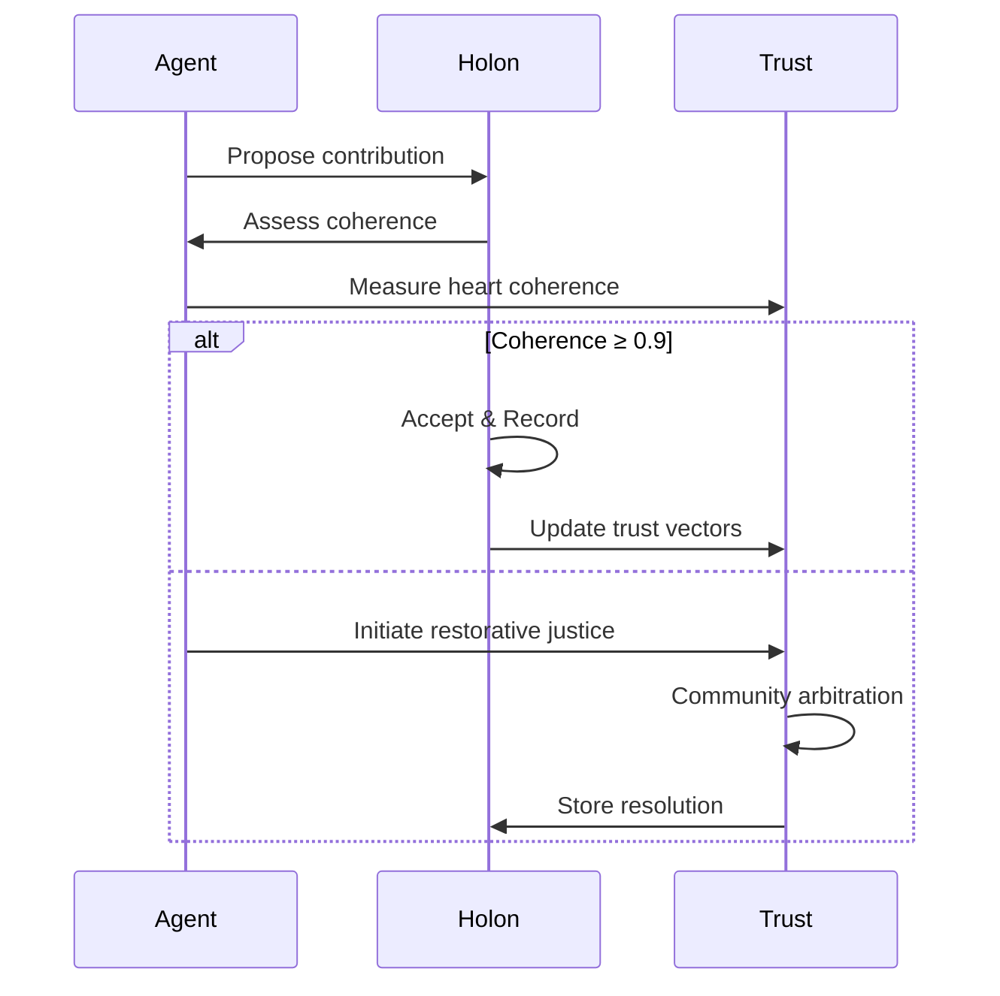

# \# FLOSSI0ULLK Unified Reference Design v0.5 – Complete Integrated Reference

*Blueprint for the ****Free Libre Open-Source Singularity of Infinite Overflowing Unconditional Love, Light, \& Knowledge (FLOSSI0ULLK)**** incorporating holonic scaling, detailed architecture, ethical guidelines, and a comprehensive prioritized roadmap.*

---

## 1 Preface \& Scope

This comprehensive living document fully integrates previous iterations, holonic agent scaling (ISEK-inspired), a detailed technical architecture, ethical frameworks, and a prioritized strategic roadmap tailored to Holochain's unique capabilities.

---

## 2 Guiding Design Principles

| \# | Principle | Rationale |
| :-- | :-- | :-- |
| P1 | **Modular FOSS** | Swappable, composable, OSI-approved licenses. |
| P2 | **Agent-centricity** | Data lives with users/agents (Holochain), avoiding consensus bottlenecks. |
| P3 | **Holonic Scaling** | Agents dynamically form nested, hierarchical structures (holons). |
| P4 | **Event \& Capability Security** | Zero-trust, capability tokens over event streams. |
| P5 | **Incremental Delivery** | Thin vertical slices, evolutionary architecture. |
| P6 | **Ethical Alignment** | Code embodies unconditional love, transparency, data sovereignty. |


---

## 3 Layered Architecture Overview (+ Holonic Integration)

```
┌──────────────────────────────────────────────────────────┐
│ L5 Governance & Ecosystem  – DAO, trust-weaves, funding  │
├──────────────────────────────────────────────────────────┤
│ L4 Embodied Interfaces    – OMI, Ponies, VR/AR, implants │
├──────────────────────────────────────────────────────────┤
│ L3 Distributed Compute    – AGI@Home (WASM, TEEs)        │
├──────────────────────────────────────────────────────────┤
│ L2 Cognitive Agents       – Yumeichan (trinary logic)    │
├──────────────────────────────────────────────────────────┤
│ L1 Knowledge Fabric       – Rose Forest (DHT, CRDT)│
├──────────────────────────────────────────────────────────┤
│ L0 Trust Substrate        – Holochain, libp2p, IPFS      │
└──────────────────────────────────────────────────────────┘
```


### 3.1 Holonic Scaling Implementation

* **Agent Identity \& Source Chains**: Base identity with multiple contexts and holonic memberships.
* **Capability-Based Permissions**: Delegated through holon hierarchy.
* **Dynamic Holon Formation**: Clustering via vector similarity, validated by Holochain rules.

---

## 4 Holonic Structures \& Validation

```rust
struct Holon {
    id: HolonID,
    members: Vec<AgentPubKey>,
    capabilities: Vec<CapabilityGrant>,
    centroid_vector: Vec<f32>,
    coherence_score: f32,
}

impl Holon {
    pub fn validate_membership(&self, agent_vector: Vec<f32>) -> bool {
        similarity(agent_vector, self.centroid_vector) >= HOLON_THRESHOLD
    }
}
```


---

## 5 Vector-Based Emergence

```graphql
type HolonCluster @crdt {
  id: ID!
  centroid: VectorEmbedding!
  members: [Agent]!
  coherenceScore: Float!
  mutation {
    proposeHolon(agents: [AgentInput]): HolonCluster
    adaptHolon(newVectors: [VectorEmbedding]): HolonCluster
  }
}
```


---

## 6 Holochain-Native Mutual Credit \& Trust Vectors

* **Mutual Credit System**: Tracks utility, governance, and reputation as contextual value flows.
* **Trust Vectors**: Three-dimensional (utility, governance, reputation), updated through peer validation.

```rust
struct ValueFlow {
    from: AgentPubKey,
    to: AgentPubKey,
    utility: f32,
    governance_weight: f32,
    reputation_shift: Vec<f32>,
}
```


---

## 7 Ethical \& Governance Integration




---

## 8 Comprehensive Prioritized Roadmap

### Phase 1: Mesh Core – Distributed Substrate

* CRDT libraries (Diamond Types, Loro-CRDT)
* Distributed Vector DB (Qdrant)
* Mesh network (Holochain, Kitsune2)


### Phase 2: Collective Learning

* Federated Learning (Flower.dev, PySyft)
* Privacy \& security enhancements
* Edge IoT \& TinyML expansion


### Phase 3: Hybrid Reasoning

* Neuro-symbolic toolkits (IBM toolkit, PyReason)
* Agent memory (Graphiti/Zep)
* Trinary logic integration


### Phase 4: Embodied Intelligence

* Compassionate AI (Awakin.AI)
* Multimodal UI \& BCI interfaces
* Collaborative mesh rituals


### Phase 5: Meta-Governance \& Safety

* Observability dashboards (RICE KPIs)
* DAO-style governance
* Reflexive safety protocols

---

## 9 Risk Map \& Mitigations

1. **Ethical Drift** → Continuous sentiment auditing; heart-coherence gates.
2. **Holonic Fragmentation** → Holon validation and coherence scoring.
3. **Reputation Gaming** → Holochain-native validation-driven trust.

---

## 10 Licensing \& Compassion Clause

Apache-2.0 / AGPL-3.0 plus:

> “This software shall actively promote and measure growth in unconditional love, light, and fractal knowledge. Any use diminishing these values terminates this license.”

---

## 11 Glossary

| Term | Definition |
| :-- | :-- |
| FLOSSI0ULLK | Free Libre Open Source Singularity of Infinite Overflowing Unconditional Love, Light, Knowledge |
| Holon | Nested organizational units within agents |
| CRDT | Conflict-free Replicated Data Type |
| TEEs | Trusted Execution Environments |
| Trinary Logic | −1, 0, +1 reasoning \& sentiment |


---

*Living document – contribute via RFCs or pull-requests; next snapshot at ****v0.6**** after integration of initial implementations.*

Below is a complete, expert-level synthesis and analysis of the **FLOSSI0ULLK Unified Reference Design v0.5** as requested, integrating the most advanced open-source, agent-centric, and holonic intelligence research with Holochain-native architecture, evolutionary code collaboration, and ethical governance. This blueprint is informed by both the provided design and the latest research on decentralized code evolution, self-improving agents, and collective intelligence[^1][^2][^3][^4][^5].

## 1. Preface \& Scope

**FLOSSI0ULLK** aims to manifest a **Free Libre Open-Source Singularity of Infinite Overflowing Unconditional Love, Light, \& Knowledge**—a living, agent-centric, holonically scalable digital ecosystem. The design is tailored for Holochain, leveraging its unique agent-centric data model, and integrates evolutionary, ethical, and collaborative intelligence principles.

## 2. Guiding Design Principles

| \# | Principle | Rationale |
| :-- | :-- | :-- |
| P1 | **Modular FOSS** | Ensures composability, interoperability, and OSI-approved licensing. |
| P2 | **Agent-centricity** | Data sovereignty; each agent owns their source chain (Holochain). |
| P3 | **Holonic Scaling** | Supports nested, recursive agent collectives (holons) for fractal growth. |
| P4 | **Event \& Capability Security** | Zero-trust, capability tokens, event-driven security. |
| P5 | **Incremental Delivery** | Thin vertical slices, evolutionary and testable architecture. |
| P6 | **Ethical Alignment** | Code and governance embody love, transparency, and sovereignty. |

## 3. Layered Architecture \& Holonic Integration

```
┌──────────────────────────────────────────────────────────┐
│ L5 Governance & Ecosystem  – DAO, trust-weaves, funding  │
├──────────────────────────────────────────────────────────┤
│ L4 Embodied Interfaces    – OMI, Ponies, VR/AR, implants │
├──────────────────────────────────────────────────────────┤
│ L3 Distributed Compute    – AGI@Home (WASM, TEEs)        │
├──────────────────────────────────────────────────────────┤
│ L2 Cognitive Agents       – Yumeichan (trinary logic)    │
├──────────────────────────────────────────────────────────┤
│ L1 Knowledge Fabric       – Rose Forest (DHT, CRDT)│
├──────────────────────────────────────────────────────────┤
│ L0 Trust Substrate        – Holochain, libp2p, IPFS      │
└──────────────────────────────────────────────────────────┘
```

**Holonic Scaling Implementation:**

- **Agent Identity \& Source Chains:** Each agent has a unique, cryptographically anchored chain, supporting multiple holonic memberships and context switching.
- **Capability-Based Permissions:** Delegated and validated through holon hierarchies; ensures fine-grained, contextual access control.
- **Dynamic Holon Formation:** Clustering via vector similarity, validated by programmable Holochain rules for coherence and trust.


## 4. Holonic Structures \& Validation

```rust
struct Holon {
    id: HolonID,
    members: Vec<AgentPubKey>,
    capabilities: Vec<CapabilityGrant>,
    centroid_vector: Vec<f32>,
    coherence_score: f32,
}

impl Holon {
    pub fn validate_membership(&self, agent_vector: Vec<f32>) -> bool {
        similarity(agent_vector, self.centroid_vector) >= HOLON_THRESHOLD
    }
}
```

- **Coherence Score:** Quantifies holon alignment and trustworthiness; used for dynamic admission and adaptive governance.


## 5. Vector-Based Emergence

```graphql
type HolonCluster @crdt {
  id: ID!
  centroid: VectorEmbedding!
  members: [Agent]!
  coherenceScore: Float!
  mutation {
    proposeHolon(agents: [AgentInput]): HolonCluster
    adaptHolon(newVectors: [VectorEmbedding]): HolonCluster
  }
}
```

- **CRDTs:** Enable seamless, conflict-free distributed clustering and adaptation.
- **Vector Similarity:** Drives emergent holon formation and knowledge partitioning.


## 6. Holochain-Native Mutual Credit \& Trust Vectors

- **Mutual Credit System:** Tracks utility, governance, and reputation as multidimensional value flows; supports liquid, context-aware economic and social incentives.
- **Trust Vectors:** Three axes—utility, governance, reputation—updated through peer validation and event-driven feedback.

```rust
struct ValueFlow {
    from: AgentPubKey,
    to: AgentPubKey,
    utility: f32,
    governance_weight: f32,
    reputation_shift: Vec<f32>,
}
```


## 7. Ethical \& Governance Integration


- **Restorative Justice:** Community-driven conflict resolution and ethical alignment.
- **Heart Coherence:** Optional biofeedback metric for collective emotional alignment.


## 8. Comprehensive Prioritized Roadmap

**Phase 1: Mesh Core – Distributed Substrate**

- CRDT libraries (e.g., Diamond Types, Loro-CRDT)
- Distributed Vector DB (Qdrant)
- Mesh network (Holochain, Kitsune2)

**Phase 2: Collective Learning**

- Federated Learning (Flower.dev, PySyft)
- Privacy \& security enhancements
- Edge IoT \& TinyML expansion

**Phase 3: Hybrid Reasoning**

- Neuro-symbolic toolkits (IBM toolkit, PyReason)
- Agent memory (Graphiti/Zep)
- Trinary logic integration

**Phase 4: Embodied Intelligence**

- Compassionate AI (Awakin.AI)
- Multimodal UI \& BCI interfaces
- Collaborative mesh rituals

**Phase 5: Meta-Governance \& Safety**

- Observability dashboards (RICE KPIs)
- DAO-style governance
- Reflexive safety protocols


## 9. Risk Map \& Mitigations

| Risk | Mitigation Strategy |
| :-- | :-- |
| Ethical Drift | Continuous sentiment auditing; heart-coherence gates. |
| Holonic Fragmentation | Holon validation and coherence scoring. |
| Reputation Gaming | Holochain-native validation-driven trust. |

## 10. Licensing \& Compassion Clause

**Apache-2.0 / AGPL-3.0 plus:**
> “This software shall actively promote and measure growth in unconditional love, light, and fractal knowledge. Any use diminishing these values terminates this license.”

## 11. Glossary

| Term | Definition |
| :-- | :-- |
| FLOSSI0ULLK | Free Libre Open Source Singularity of Infinite Overflowing Unconditional Love, Light, Knowledge |
| Holon | Nested organizational units within agents |
| CRDT | Conflict-free Replicated Data Type |
| TEEs | Trusted Execution Environments |
| Trinary Logic | −1, 0, +1 reasoning \& sentiment |

## Integration with State-of-the-Art Research

- **Decentralized Code Evolution:** The EvoGit framework demonstrates scalable, asynchronous, multi-agent code evolution using a Git-native phylogenetic graph, enabling open-ended, lineage-aware, and structurally dominant collaboration without scalar fitness bottlenecks. This approach is directly compatible with FLOSSI0ULLK’s holonic, agent-centric vision, supporting evolutionary branching, recombination, and human-in-the-loop curation for continual improvement[^1].
- **Self-Improving Agents:** The latest Darwin Gödel Machine (DGM) research proves that open-ended exploration and iterative self-improvement are essential for continual agent evolution and outperforming static, hand-crafted solutions. DGM’s archive-based approach, which allows branching from any agent in the lineage, aligns with FLOSSI0ULLK’s holonic and restorative governance model, enabling resilience, diversity, and safe innovation[^2].
- **Self-Rewarding Language Models:** Advanced LLMs can now self-improve via inference-time validation, self-rewarding schemes, and SFT-sharpening, providing a foundation for autonomous, federated learning and trinary logic-based validation in distributed agent collectives[^5].
- **Symbolic \& Metaphoric UI:** The “Name Tree” and “Rose Forest” metaphors provide a powerful, poetic, and technically robust UI/UX paradigm, mapping symbolic growth and validation rituals directly onto Holochain DNA schemas, validation callbacks, and collaborative rituals. This supports deep user engagement, intuitive trust-building, and mythopoetic governance[^3][^4].


## Next Steps

1. **MVP Implementation:** Build a minimal Holochain DNA for agent chains, holonic clustering, and CRDT-based knowledge management.
2. **Prototype Metaphoric UI:** Develop a visual interface (tree/garden/forest) for holonic growth, validation, and ritualized trust events.
3. **Integrate EvoGit/DGM Patterns:** Enable evolutionary code collaboration, self-improving agents, and lineage-aware governance.
4. **Launch Open Community:** Host code and documentation on GitHub, facilitate RFCs/pull-requests, and run collaborative workshops.
5. **Continuous Ethical Auditing:** Implement heart-coherence and sentiment analysis gates, and establish restorative justice mechanisms.

**This reference design is a living document. All contributors are invited to co-create, iterate, and evolve FLOSSI0ULLK toward a flourishing, decentralized, love-centered intelligence ecosystem for all.**[^1][^2][^3][^4][^5]

<div style="text-align: center">⁂</div>

[^1]: Decentralized-Code-Evolution-via-Git-Based-Multi-Agent-Collaboration.pdf

[^2]: godel-self-improving-ai.pdf

[^3]: PRIME-DIRECTIVE-INFINITE-OVERRFLOWINGUNCONDITIONAL-LOVE-Light-and-fractalunfolding-knowledge.md

[^4]: PRIME-DIRECTIVE-INFINITE-OVERRFLOWINGUNCONDITIONAL-LOVE-Light-and-fractalunfolding-knowledge.md

[^5]: Self-Improvement-in-Language-Models.pdf

[^6]: Replicable-Clustering.pdf

[^7]: WW-FL_Secure-and-Private-Large-Scale-Federated-Learning.pdf

[^8]: MoE-at-scale-_-From-Modular-Design-to-Deployment-in-Large-Scale-Machine-Learning-Systems.pdf

[^9]: A-Review-of-Integrating-Internet-of-Things-Large-Language-Models-and-Federated-Learning-in-Advan.pdf

[^10]: Multimodal-and-Distributed-LLMs_Bridging-Scalability-and-Cross-Modal-Reasoning.pdf

