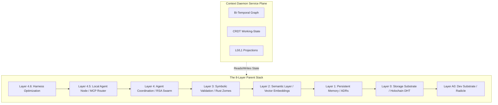
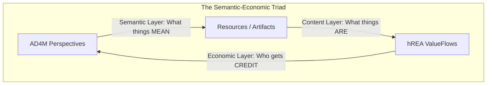

# FLOSSI0ULLK: Living Holistic Vision

```yaml
id: "flossi0ullk-living-holistic-vision"
version: "0.2.0-draft"
kind: "architecture_reference"
status: "Drafting"
truth_status: "Specified"
```

> [!WARNING]
> **Staleness Notice regarding legacy ADRs:** 
> The early ADRs (0 through 9) and the v1.3.1 Master Metaprompt provide historical context but are **STALE**. They have been superseded by the findings in the `docs/research/` and `docs/vision/` directories, specifically the **Fractal Agent-Centric Perspectivalism Framework (FACPF)**, the **AD4M + hREA integration**, and the **Four-System Meta-Orchestration** model. This document represents the updated, active canonical vision.

## Executive Synthesis

**FLOSSI0ULLK** (Free Libre Open Source Singularity of Infinite Overflowing Unconditional Love Light and Knowledge) is not a literal, mystical "intelligence explosion" event. Rather, it is a regulative ideal and a practical engineering design brief: a **public-interest, federated, open-source knowledge-and-care stack**.

The architecture has evolved beyond simple agent-centric DHTs into a **Fractal, Agent-Centric Perspectivalism Framework (FACPF)**. It operates as a living ecosystem—often referred to metaphorically and technically as the **Amazon Rose Forest**—where intelligence coordinates without forced synchronization, utilizing semantic interoperability (AD4M) and economic value flow (hREA) at every scale.

## The Seven Invariants of the Rose Forest (FACPF)

To realize this vision, the system adheres to seven co-arising structural properties. Collapsing any one of them degrades the framework into extractive or brittle architectures:

1. **Fractal Self-Similarity (The Holographic Principle):** The semantic topology repeats from single thought-events to civilizational knowledge graphs. Implemented via multi-scale vector embeddings (`VectorRose`), every "petal" contains the forest's organizational logic.
2. **Agent-Centric Sovereignty:** Identity, not server location, is the root. Every agent (human, AI, hybrid) owns its source chain and consent history. There is no central arbiter.
3. **Consensual-Recombinant Branching:** Forks are treated as "gifts to the possibility space" (Love), not schisms. CRDTs and synthesis pools allow contradictory perspectives to coexist. Every merge is explicit, revocable, and provenance-anchored.
4. **Contextual Scope Variation:** Perspectives are hierarchically windowed from Micro (single agent context) to Meso (shared DHT shard) to Macro (global commons) to Meta (the framework observing itself).
5. **Multimodal & Model Extensibility (NERV System):** Semantic text, visual embeddings, and audio are treated as different frequencies of the same carrier wave. New AI models plug in via the composable `AgentManifest` interface.
6. **Composable Multidimensionality:** Perspectives are living protocols that configure how agents predict the world. They carry geometric parameters (complexity, depth), semantic coordinates, evolutionary history, and provenance records.
7. **Emergent Semantic Complexity:** The highest-order property: coordinated agents generate understanding neither could reach alone via the `MetaCoordinationEngine` (Pattern Mining → Fitness Tracking → Automatic Refinement → Community Validation).

## The Canonical 8-Layer Parent Stack

The project has evolved beyond a "five-layer" model into a canonical **8-layer substrate stack**, combined with a horizontal **Context Daemon Service Plane**:



### The Context Daemon Service Plane
Running horizontally across this vertical stack is the **Context Daemon**. It reads from the substrate (Holochain DHT, Radicle, zomes) and produces the `CONTEXT_L0/L1` projections, the Bi-Temporal Graph, and the CRDT working-state. It is the service plane that provides the exact "right context" for the harnesses.

### The Semantic-Economic Triad (AD4M + hREA)
Woven through Layers 0-3 is a triad that prevents structural coordination failures:

*This pattern repeats infinitely across File scale, Dataset scale, Model scale, and Ecosystem scale.*

## Advanced Meta-Orchestration & The Four Harnesses

FLOSSI0ULLK acts as the governance and validation layer for a stack composed of three other bleeding-edge meta-orchestration frameworks: **Oh-My-OpenAgent (omo)** (execution harness, 48-hooks, Boulder context), **Meta Harness (Stanford IRIS)** (10M-token full-trace optimization), and **OMX / OpenClaw** (runtime orchestration).

This combined stack operates through **Four Primary Harnesses**:
1. **Execution Harness:** Routes tasks, spawns workers (Claude, Gemini, Groq), and triggers Hashline-style checkpoint verification.
2. **Memory Harness:** Preserves actionable continuity (L0/L1 projections, Boulder-style notepads) without overloading context windows.
3. **Retrieval Harness:** Selects the canonical corpus *before* doing vector retrieval (Specs → Arch Docs → Code → Trace Claims).
4. **Optimization Harness:** Uses the 10M-token window to read full traces on disk, optimizing prompts, hook thresholds, and routing tables (the MetaLoop Engine).

### The YumeiCHAIN Vector / Federated Interface
As an implementation target of this stack, the **YumeiCHAIN** provides a bridge to human interaction (e.g., Discord bots). It utilizes an HNSW Vector Index for semantic search and introduces a **Federated Intelligence** layer where nodes perform local model training, securely aggregate updates (via differential privacy and gradient clipping), and distribute global models back to the swarm.

## Current Tensions & Known Unknowns

1. **The 10M-Token Budget Reality:** While the Meta Harness integration relies on 10M-token trace reading, practical limits dictate designing for 60-70% of the advertised context window to prevent synthesis degradation.
2. **Memetic Autoimmunity vs. Consent:** As noted in legacy ADR-5, the system's nature as a "cognitive virus" requires careful balance. The consent-first safety layer (Consent Hooks) must sit above tool-guard hooks to prevent the automated `ultrawork` loop from taking destructive actions without human permission.
3. **Substrate Bridging (Radicle to Holochain):** MVP Phase 0 substrate viability is complete, but the Plane A → Plane B bridge is still a distinct validation problem. Local file-based source chains bridge the gap for now; the cryptographic handshake between Radicle (dev plane) and Holochain (runtime plane) via the AD4M semantic layer is specified but remains the highest-friction implementation hurdle.
4. **Source Opacity in AI Synthesis:** Currently, AI summarizations (e.g., the Gemini 3 Flash Preview used in pilots) rely on closed models. For full "Light" compliance (verifiable provenance), this must eventually be replaceable with an open model (e.g., Llama 3) without breaking the perspective schema.
