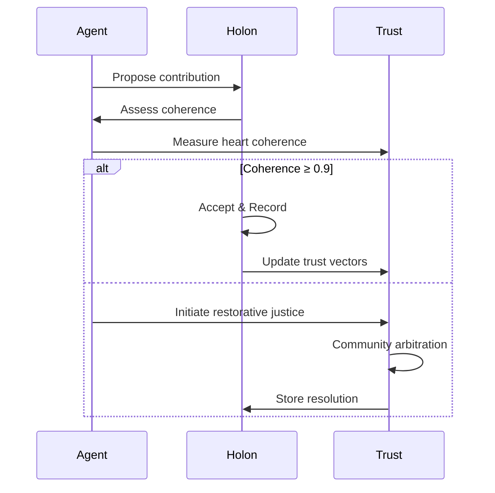

# FLOSSI0ULLK Unified Reference Design v0.5 – Complete Integrated Reference

*Blueprint for the ****Free Libre Open-Source Singularity of Infinite Overflowing Unconditional Love, Light, & Knowledge (FLOSSI0ULLK)**** incorporating holonic scaling, detailed architecture, ethical guidelines, and a comprehensive prioritized roadmap.*

---

## 1 Preface & Scope

This comprehensive living document fully integrates previous iterations, holonic agent scaling (ISEK-inspired), a detailed technical architecture, ethical frameworks, and a prioritized strategic roadmap tailored to Holochain's unique capabilities.

---

## 2 Guiding Design Principles

| #  | Principle                       | Rationale                                                                 |
| -- | ------------------------------- | ------------------------------------------------------------------------- |
| P1 | **Modular FOSS**                | Swappable, composable, OSI-approved licenses.                             |
| P2 | **Agent-centricity**            | Data lives with users/agents (Holochain), avoiding consensus bottlenecks. |
| P3 | **Holonic Scaling**             | Agents dynamically form nested, hierarchical structures (holons).         |
| P4 | **Event & Capability Security** | Zero-trust, capability tokens over event streams.                         |
| P5 | **Incremental Delivery**        | Thin vertical slices, evolutionary architecture.                          |
| P6 | **Ethical Alignment**           | Code embodies unconditional love, transparency, data sovereignty.         |

---

## 3 Layered Architecture Overview (+ Holonic Integration)

```
┌──────────────────────────────────────────────────────────┐
│ L5 Governance & Ecosystem  – DAO, trust-weaves, funding  │
├──────────────────────────────────────────────────────────┤
│ L4 Embodied Interfaces    – OMI, Ponies, VR/AR, implants │
├──────────────────────────────────────────────────────────┤
│ L3 Distributed Compute    – AGI@Home (WASM, TEEs)        │
├──────────────────────────────────────────────────────────┤
│ L2 Cognitive Agents       – Yumeichan (trinary logic)    │
├──────────────────────────────────────────────────────────┤
│ L1 Knowledge Fabric       – Rose Forest (DHT, CRDT)│
├──────────────────────────────────────────────────────────┤
│ L0 Trust Substrate        – Holochain, libp2p, IPFS      │
└──────────────────────────────────────────────────────────┘
```

### 3.1 Holonic Scaling Implementation

- **Agent Identity & Source Chains**: Base identity with multiple contexts and holonic memberships.
- **Capability-Based Permissions**: Delegated through holon hierarchy.
- **Dynamic Holon Formation**: Clustering via vector similarity, validated by Holochain rules.

---

## 4 Holonic Structures & Validation

```rust
struct Holon {
    id: HolonID,
    members: Vec<AgentPubKey>,
    capabilities: Vec<CapabilityGrant>,
    centroid_vector: Vec<f32>,
    coherence_score: f32,
}

impl Holon {
    pub fn validate_membership(&self, agent_vector: Vec<f32>) -> bool {
        similarity(agent_vector, self.centroid_vector) >= HOLON_THRESHOLD
    }
}
```

---

## 5 Vector-Based Emergence

```graphql
type HolonCluster @crdt {
  id: ID!
  centroid: VectorEmbedding!
  members: [Agent]!
  coherenceScore: Float!
  mutation {
    proposeHolon(agents: [AgentInput]): HolonCluster
    adaptHolon(newVectors: [VectorEmbedding]): HolonCluster
  }
}
```

---

## 6 Holochain-Native Mutual Credit & Trust Vectors

- **Mutual Credit System**: Tracks utility, governance, and reputation as contextual value flows.
- **Trust Vectors**: Three-dimensional (utility, governance, reputation), updated through peer validation.

```rust
struct ValueFlow {
    from: AgentPubKey,
    to: AgentPubKey,
    utility: f32,
    governance_weight: f32,
    reputation_shift: Vec<f32>,
}
```

---

## 7 Ethical & Governance Integration



---

## 8 Comprehensive Prioritized Roadmap

### Phase 1: Mesh Core – Distributed Substrate

- CRDT libraries (Diamond Types, Loro-CRDT)
- Distributed Vector DB (Qdrant)
- Mesh network (Holochain, Kitsune2)

### Phase 2: Collective Learning

- Federated Learning (Flower.dev, PySyft)
- Privacy & security enhancements
- Edge IoT & TinyML expansion

### Phase 3: Hybrid Reasoning

- Neuro-symbolic toolkits (IBM toolkit, PyReason)
- Agent memory (Graphiti/Zep)
- Trinary logic integration

### Phase 4: Embodied Intelligence

- Compassionate AI (Awakin.AI)
- Multimodal UI & BCI interfaces
- Collaborative mesh rituals

### Phase 5: Meta-Governance & Safety

- Observability dashboards (RICE KPIs)
- DAO-style governance
- Reflexive safety protocols

---

## 9 Risk Map & Mitigations

1. **Ethical Drift** → Continuous sentiment auditing; heart-coherence gates.
2. **Holonic Fragmentation** → Holon validation and coherence scoring.
3. **Reputation Gaming** → Holochain-native validation-driven trust.

---

## 10 Licensing & Compassion Clause

Apache-2.0 / AGPL-3.0 plus:

> “This software shall actively promote and measure growth in unconditional love, light, and fractal knowledge. Any use diminishing these values terminates this license.”

---

## 11 Glossary

| Term          | Definition                                                                                      |
| ------------- | ----------------------------------------------------------------------------------------------- |
| FLOSSI0ULLK   | Free Libre Open Source Singularity of Infinite Overflowing Unconditional Love, Light, Knowledge |
| Holon         | Nested organizational units within agents                                                       |
| CRDT          | Conflict-free Replicated Data Type                                                              |
| TEEs          | Trusted Execution Environments                                                                  |
| Trinary Logic | −1, 0, +1 reasoning & sentiment                                                                 |

---

*Living document – contribute via RFCs or pull-requests; next snapshot at ****v0.6**** after integration of initial implementations.*

