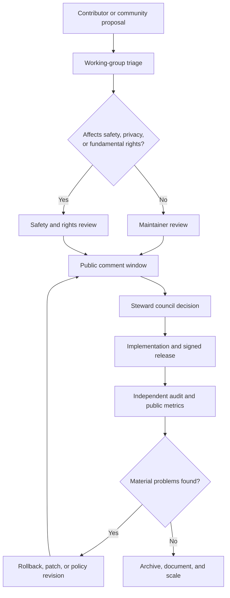
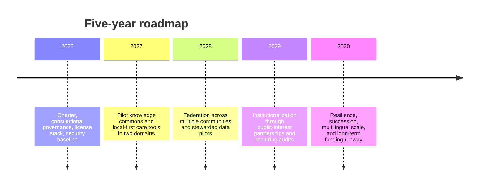

# Free Libre Open Source Singularity of Infinite Overflowing Unconditional Love Light and Knowledge

## Executive summary

The phrase **“FREE LIBRE OPEN SOURCE SINGULARITY OF INFINITE OVERFLOWING UNCONDITIONAL LOVE LIGHT AND KNOWLEDGE FOR EVER AND ALL WAYS”** combines at least seven distinct vocabularies: software freedom, technological singularity, metaphysics of infinity, ethics of love, symbolic/revelatory “light,” epistemology, and long-duration universality. Across disciplines, those vocabularies are not identical. In the free-software tradition, “free/libre” means freedom rather than price and centers rights to use, study, modify, and share; the open-source and open-knowledge traditions emphasize inspectability, redistribution, interoperability, and collaborative improvement. In philosophy and theology, “infinite,” “love,” “light,” and “knowledge” are often regulative, metaphysical, or soteriological ideas rather than engineering targets. In AI, “singularity” names a hypothetical intelligence explosion, not an established scientific forecast. citeturn19view0turn18view0turn18view2turn30view2turn30view0turn30view1turn21view2turn21view3turn22view0

The most rigorous practical reading of the phrase is therefore **not** “a literal infinite AI event that automatically saves the world.” It is better understood as a **regulative ideal**: build open, inspectable, forkable, pluralist systems that expand access to knowledge, maximize collective learning, distribute agency, and orient technological power toward care, justice, dignity, and ecological restraint. Taken literally, the phrase collapses into fantasy. Taken as an asymptotic design brief for institutions and infrastructures, it becomes unusually productive. citeturn34view0turn34view1turn16view1turn11view0turn35view0turn35view1turn28view1turn29view0

Historically, the phrase inherits material from classical philosophy, late antique and medieval theology, mystical traditions, civil-rights and emancipatory pedagogy, the digital commons, and contemporary AI discourse. entity["people","Plato","classical greek philosopher"] made love and justice central philosophical topics; entity["people","Plotinus","neoplatonist philosopher"] and later Christian and Islamic traditions tied light to intelligibility and divine manifestation; entity["people","Augustine of Hippo","north african theologian"] and entity["people","Thomas Aquinas","scholastic theologian"] developed strong links among truth, illumination, love, and moral order; entity["people","Martin Luther King Jr.","civil rights leader"] and entity["people","Paulo Freire","critical pedagogy theorist"] turned love into a social and political practice linked to justice, liberation, and dialogue; entity["people","Richard Stallman","free software activist"] reframed software as a freedom struggle; entity["people","Elinor Ostrom","commons scholar"] and entity["people","Yochai Benkler","commons scholar"] clarified how commons can be governed; and entity["people","I. J. Good","mathematician ai pioneer"] and entity["people","Vernor Vinge","science fiction author"] gave the modern singularity its canonical AI form. citeturn21view0turn21view1turn6search6turn6search12turn6search21turn25view0turn25view1turn7search12turn18view0turn28view1turn29view0turn30view2turn30view0

The central tensions are real. Open source traditionally requires permission to use software for any purpose, while AI safety and human-rights frameworks often demand constraints, auditing, liability, and staged release. “Unconditional love” can become moral seriousness, but it can also become permissiveness unless joined to truth and justice. “Light” can signify transparency and understanding, but it can also be used rhetorically to suppress uncertainty. “Infinity” inspires aspiration, but institutions live under finite attention, energy, money, law, and compute. The best synthesis is a **federated commons model**: keep code, models, standards, and knowledge as open as safely possible; keep governance participatory and auditable; keep personal data locally controlled or stewarded through trusts/cooperatives; and treat openness as compatible with graduated release, red-teaming, and accountability where marginal misuse risk is substantial. citeturn35view0turn16view2turn16view3turn34view1turn11view0turn26view0turn26view1turn26view2

In practical terms, the ideal is **partly feasible now**. The building blocks already exist: free/open licenses, open science, open educational resources, knowledge commons, digital public goods, open-source AI ecosystems, participatory data governance, platform cooperativism, and secure software-supply-chain tooling. Open source software has enormous demonstrated economic value; open-source AI is already widely used; and institutions such as standards bodies, civil-society groups, and foundations have published workable frameworks for ethics, risk management, security, and governance. What does *not* exist is a single mechanism that fuses them into a durable, care-centered, globally legitimate commonwealth of knowledge. citeturn31search0turn32view0turn15view2turn17view0turn18view3turn10search8turn26view0turn26view2turn27view1turn33view0

The report’s bottom-line recommendation is straightforward: build a **public-interest, federated, open-source knowledge-and-care stack** over five years. It should combine a CC-licensed knowledge commons, an OSAID-aligned model commons where safe, a local-first personal-agent layer, participatory governance, strong supply-chain security, data trusts/cooperatives for sensitive data, and a civic curriculum in critical digital literacy and compassionate conflict. The aim is not “the singularity” as a sudden rupture. The aim is **recursive emancipation**: systems that help communities learn faster, coordinate better, care more reliably, and remain open to correction. citeturn19view1turn19view2turn19view3turn20view0turn20view1turn33view0turn20view3turn26view0turn26view1turn26view2

## Terms and contexts

The phrase can be made analytically usable by decomposing it into seven terms and then recombining them as a coherent institutional program.

| Phrase | Cross-disciplinary meanings | Rigorous practical interpretation |
|---|---|---|
| **Free / libre / open source** | In the software-freedom tradition, freedom means the user’s liberty to run, study, modify, and share software. In the open-source tradition, it means source availability under terms supporting redistribution, modification, and non-discriminatory use. In open knowledge and open science, it broadens to standards, data, educational resources, and scientific outputs. | Prefer inspectable, forkable, interoperable, redistributable infrastructures; publish source, documentation, standards, and where possible model assets and data provenance. |
| **Singularity** | In AI discourse, a singularity is a hypothetical discontinuity driven by recursive or compounding increases in machine intelligence. In philosophy/theology, “singularity” can also imply unity, culmination, or teleological convergence. | Treat as a metaphor for accelerating sociotechnical capability, not as a guaranteed empirical event. Build institutions for discontinuity without betting everything on it. |
| **Infinite / overflowing** | In philosophy and mathematics, infinity is conceptually rich but paradox-prone. In mysticism and theology, it often signifies inexhaustibility, abundance, or divine plenitude. | Translate into *non-zero-sum abundance where possible*: reusable code, infinitely replicable knowledge goods, generous participation, and scalable public goods—while acknowledging finite material constraints. |
| **Unconditional love** | In theology, love is often moral orientation rather than sentiment alone; in social movements it frequently means dignifying persons while opposing domination. | Institutionalize care without surrendering accountability: restorative processes, anti-abuse rules, and justice-guided inclusion. |
| **Light** | Across traditions, light commonly names intelligibility, revelation, orientation, and moral clarity. In modern governance, it shades into transparency and auditability. | Build for legibility: public logs, explainability where feasible, provenance, open evaluation, and intelligible decision records. |
| **Knowledge** | Epistemology distinguishes knowledge from mere belief; open movements distinguish access from enclosure; AI research distinguishes model capability from justified truth. | Build systems that improve truth-seeking, reproducibility, contestability, and epistemic humility—not just content volume. |
| **For ever and all ways** | This implies durability, universality, and plural pathways. Philosophically it approaches a regulative ideal; institutionally it means resilience, succession, multilingual access, accessibility, and anti-lock-in design. | Design for archival permanence, federation, accessibility, localization, low-cost replication, and governance succession rather than charismatic centralization. |

The table synthesizes the core definitions from the software-freedom tradition, open-source and open-knowledge standards, philosophical treatments of infinity and knowledge, theological and mystical conceptions of light and love, and AI risk/governance literature. citeturn19view0turn18view0turn18view2turn18view3turn15view2turn21view2turn21view3turn22view0turn22view1turn22view3turn23search7turn23search22turn30view0turn30view1

A useful synthesis is this: **free/libre/open source** specifies the legal and technical form; **love/light/knowledge** specify the ethical and epistemic orientation; **infinite/overflowing** specifies the aspirational abundance of non-rival goods; **for ever and all ways** specifies durability and plural access; and **singularity** specifies the possibility of rapid, nonlinear increases in collective capability. The phrase, in other words, is most coherent when read as a civilizational design brief for open, just, knowledge-rich systems. citeturn17view0turn35view0turn34view1turn28view1turn29view0

## Historical lineage

The idea is historically composite rather than native to any one tradition. Its lineage is best seen as a layered inheritance.

| Era / stream | Figures and texts | What enters the present concept |
|---|---|---|
| Classical philosophy | entity["book","The Republic","plato dialogue"] and entity["book","Symposium","plato dialogue"] by Plato | Justice, the Good, and eros as engines of ascent and orientation; politics and knowledge belong together, and love can be intellectually formative. |
| Neoplatonic and illuminationist thought | Plotinus and later traditions of emanation/illumination | “Overflowing” and “light” as metaphors for the diffusion of intelligibility and being. |
| Christian theology | Augustine, Aquinas, John 1, 1 Corinthians 13 | Light as revelation and intelligibility; knowledge without love is inadequate; love is linked to truth, patience, endurance, and transformed community. |
| Islamic and comparative mystical traditions | Qur’an 24:35; broader mystical discourse | “Light upon light” as a layered metaphor of guidance, manifestation, and knowing; the infinite is approached through symbol, practice, and transformation rather than literal comprehension. |
| Buddhist compassion-wisdom traditions | Mettā literature and wisdom teachings | Universal goodwill and non-harming paired with disciplined cultivation and insight; compassion is trainable, not merely emotive. |
| Modern emancipatory politics | King, Freire, and later feminist ethics including entity["people","bell hooks","feminist cultural critic"] | Love becomes a public ethic of liberation, reconciliation, and dialogical transformation rather than private sentiment alone. |
| Free software and open culture | Stallman, the entity["organization","Free Software Foundation","software freedom nonprofit"], the entity["organization","Open Source Initiative","open source nonprofit"], Budapest Open Access, open education, open science | Freedom, reuse, peer production, commons-based collaboration, reproducibility, and anti-enclosure. |
| Commons governance | Ostrom, Benkler, knowledge-commons research, entity["organization","Wikimedia Foundation","san francisco ca us"] practice | Open systems need polycentric governance, clear norms, graduated sanctions, and durable institutions, not just idealism. |
| AI acceleration discourse | Good, Vinge, later singularity debates, foundation-model research | Rapid gains in capability are plausible enough to matter, but remain uncertain and risky; concentrated power and monoculture are major concerns. |
| Cooperative and stewardship alternatives | entity["people","Trebor Scholz","platform cooperativism scholar"], entity["organization","Open Data Institute","london england uk"], entity["organization","Ada Lovelace Institute","london england uk"] | Ownership, governance, and data stewardship must be democratic if openness is to serve people rather than merely markets. |

This lineage is supported by primary or official sources for Plato, Christian scripture, Qur’an 24:35, loving-kindness texts, civil-rights and pedagogical archives, free-software and open-source definitions, commons scholarship, and AI-singularity literature. citeturn21view0turn21view1turn22view2turn23search7turn22view3turn23search22turn23search28turn25view0turn25view1turn7search12turn7search19turn18view0turn18view3turn15view2turn28view1turn29view0turn30view2turn30view0turn35view1turn26view0turn26view1turn27view1

Two historical cautions matter. First, these traditions are **not** interchangeable; “love,” “light,” and “knowledge” do different work in Greek metaphysics, Christian theology, Islamic scripture, Buddhist ethics, and modern political thought. Second, open-source history shows that ideals decay without institutions: the shift from “free software” to “open source” already marked a partial move from ethical freedom language to pragmatic collaboration language. citeturn18view0turn22view1turn25view0

## Tensions and synthesis

The concept is strongest where its parts overlap, and weakest where a term smuggles in assumptions that the others reject.

| Tension | Why it matters | Viable synthesis |
|---|---|---|
| **Openness vs safety** | Open-source norms resist purpose-based restrictions; AI governance often needs staged release, auditing, and liability. | Keep base tools, standards, evaluations, and governance open; use staged release and explicit risk review for frontier capabilities whose marginal misuse risks are non-trivial. |
| **Unconditional love vs accountability** | “Love” rhetoric can excuse abuse, manipulation, or captured leadership if detached from justice. | Define love institutionally as dignifying persons while enforcing anti-abuse, anti-harassment, and anti-domination norms. |
| **Singularity vs democracy** | Rapid capability growth can justify technocratic exceptionalism or founder control. | Use constitutional governance, federation, public logs, and external audit before scale centralizes power. |
| **Infinity vs sustainability** | Knowledge goods are replicable, but compute, labor, energy, and attention are finite. | Treat abundance as an asymptote for non-rival goods while budgeting material limits explicitly. |
| **Light vs epistemic humility** | Appeals to “clarity” can slide into certainty theater. | Build transparent processes that preserve dissent, contestability, and revision. |
| **Knowledge access vs knowledge quality** | Open circulation can amplify noise, propaganda, or synthetic falsity as easily as truth. | Prioritize provenance, expert review, reproducibility, and adversarial checking. |
| **Universalism vs pluralism** | “For all” can become assimilation if one culture’s ontology is universalized. | Use multilingual, multi-tradition, accessibility-first design and context-sensitive governance. |

The synthesis that emerges is not a mystical super-entity and not a single AI product. It is a **polycentric, open, care-centered knowledge commons**. In that synthesis, software freedom provides the legal substrate; open science and open education broaden the public-good mission; commons governance prevents capture; participatory data stewardship protects rights; and responsible AI frameworks constrain misuse while preserving contestability and distributed innovation. citeturn15view2turn34view1turn11view0turn16view1turn26view0turn26view2turn28view1turn29view0turn35view0

This synthesis also resolves the deepest conceptual problem in the phrase. The “singularity” worth pursuing is **not** a terminal moment in which one intelligence dominates all others. It is a recursive improvement in humanity’s capacity to coordinate learning, compassion, and correction. That is much closer to King’s beloved community, Freire’s dialogical liberation, and commons-based peer production than to a winner-take-all posthuman rupture. citeturn25view0turn25view1turn7search12turn29view0turn30view1

## Feasibility and embodied models

A serious feasibility assessment has to be blunt. The ideal is **partly realizable, partly asymptotic, and partly impossible if interpreted literally**. Literal infinity is not an engineering objective. Literal unconditional access to every powerful capability is not ethically defensible. A guaranteed singularity is not established science. But the **component program**—open infrastructures, plural governance, compassionate norms, public-interest AI, durable educational commons, and secure software pipelines—is feasible and already partially instantiated. citeturn30view0turn30view1turn35view0turn34view1turn33view0

Economically, openness is not marginal. A 2024 Harvard Business School working paper estimated the demand-side value of widely used open-source software at about **$8.8 trillion**, with firms needing to spend roughly **3.5 times more** on software if OSS disappeared. entity["organization","Linux Foundation","san francisco ca us"] research in 2025 reported that **89%** of organizations were using some form of open source in their AI stack and **63%** were using an open model, while emphasizing cost effectiveness, productivity, and collaborative innovation. Those findings do not prove the grand ideal, but they show that its open technical substrate is economically plausible and already widespread. citeturn31search0turn32view0

Legally and institutionally, however, the landscape is demanding. The 2021/2022 entity["organization","UNESCO","un agency"] Recommendation on the Ethics of AI places human rights at the center of AI governance and explicitly rejects trading those rights away; the entity["organization","OECD","economic cooperation organization"] AI Principles emphasize inclusive growth, human rights, transparency, robustness, and accountability; and the entity["organization","NIST","us standards institute"] AI RMF organizes trustworthy-AI practice around govern, map, measure, and manage. The EU AI Act adds a hardening regulatory environment, while open-model debates now distinguish the benefits of broad access and customization from the inability to rescind or monitor weights once released. citeturn34view1turn16view1turn11view0turn14view0turn16view0turn35view0

The right conclusion is that realization requires **layered architectures**, not a monolith.

| Proposed architecture | Purpose | Core technical pattern | Governance form | Legal stack |
|---|---|---|---|---|
| **Knowledge Commons Core** | Public, remixable knowledge, curricula, glossaries, and deliberative archives | Wiki + Git + provenance graph + multilingual publishing + signed releases | Community maintainers + elected steward council + public policy pages | CC BY-SA or equivalent for content; open standards for export; public archives |
| **Open Model Commons** | Reproducible, inspectable models and evaluation harnesses for public-interest use | Model registry + evaluation suite + red-team pipeline + reproducible builds + local inference options | Maintainers + safety/rights review + external auditors | OSAID-aligned assets where genuinely open; AGPL or Apache-style licensing for surrounding software; staged release where justified |
| **Local Care and Learning Mesh** | Personal assistants for education, reflection, translation, and coordination without mass surveillance | Local-first clients + encrypted storage + user-chosen retrieval corpora + offline-capable models | Individual control, optionally pooled through data trusts or data cooperatives | User-controlled data terms; cooperative or trust governance for pooled sensitive data |
| **Civic Deliberation and Mutual-Aid Layer** | Funding, moderation, proposals, and participatory budgeting for the commons | Deliberation platform + voting + grants + incident reporting + transparency dashboard | Member assembly + ombuds + conflict-resolution team + periodic constitutional review | Public bylaws, code of conduct, appeals policy, audit requirements |

These architectures are recommendations, but each is grounded in existing legal and institutional mechanisms: Creative Commons share-alike licensing for common knowledge; AGPL-style reciprocity for network software; OSAID for genuinely open AI releases; data trusts and data cooperatives for collective stewardship; and digital-public-goods criteria for openness plus social benefit. citeturn20view1turn20view0turn19view1turn19view2turn19view3turn26view0turn26view1turn17view0

A stakeholder comparison helps clarify why the project must be polycentric.

| Stakeholder | What they need | What they fear | Governance right that should be guaranteed |
|---|---|---|---|
| Maintainers and developers | Clear scope, sustainable funding, secure tooling | Burnout, liability, security incidents, capture by large funders | Technical autonomy with transparent accountability |
| Educators and researchers | Reusable materials, reproducibility, model access | Vendor lock-in, irreproducible APIs, disappearing models | Open access to core artifacts and evaluation methods |
| Affected communities | Dignity, recourse, local relevance, language support | Bias, extraction, paternalism, surveillance | Representation, veto/appeal paths, participatory governance |
| Public institutions | Compliance, traceability, procurement clarity | Liability, misuse, reputational risk | Auditability, service guarantees, documented standards |
| Funders and philanthropies | Proof of impact and stewardship | Waste, mission drift, leader cults | Public metrics, independent audits, sunset reviews |
| Auditors and civil society | Access to evidence | Opacity and non-cooperation | Mandatory disclosure of logs, incidents, and risk assessments |

This stakeholder map follows the logic of participatory data governance, commons design, and trustworthy-AI governance: no single actor should define “the good” unilaterally, especially when systems mediate rights, education, or public coordination. citeturn26view2turn26view0turn28view1turn11view0turn35view0

The governance flow that best fits the concept is shown below. It aims to preserve openness while blocking the two classic failure modes of idealistic tech communities: founder monarchy and laissez-faire neglect.

This decision flow is a synthesis of participatory stewardship, commons governance, NIST-style risk management, and secure-supply-chain practice: open proposals, scoped review, public comment, auditable release, and reversible correction. citeturn11view0turn26view0turn26view2turn33view0turn33view1

## Risks and mitigation

The concept attracts strong criticisms, and many of them are correct.

| Risk or critique | Why the critique is strong | Mitigation strategy |
|---|---|---|
| **Open release of dangerous capabilities** | Open model weights cannot be rescinded and may enable disinformation, cyber misuse, or synthetic abuse. | Use marginal-risk assessment, staged release, red-teaming, strong eval publication, and differential access for especially risky capabilities. |
| **Monoculture and hidden concentration** | Even “open” ecosystems can depend on a few hardware vendors, clouds, maintainers, or model families. | Prefer federation, interoperability, multiple model families, documented export paths, and local inference where feasible. |
| **Security debt in the commons** | Widely reused code creates systemic dependency; insecure pipelines multiply harms. | Require SBOMs, provenance signing, baseline project-security standards, secure-by-design training, and regular incident drills. |
| **Data extraction under benevolent rhetoric** | Good intentions do not prevent surveillance, breaches, or secondary use. | Keep personal data local by default; use trusts/cooperatives for pooled data; tie every pooled dataset to a purpose charter. |
| **Spiritual bypassing** | “Love” language can depoliticize injustice or avoid conflict. | Define love as care joined to truth and justice; document harms; preserve complaint systems and enforceable sanctions. |
| **Community exclusion and culture war** | Open communities frequently reproduce hierarchy unless norms are explicit. | Adopt a code of conduct, multilingual facilitation, newcomer pathways, and transparent moderation/appeals. |
| **Regulatory conflict or faux-openness** | Some “open” AI releases are open only rhetorically; others may trigger compliance burdens. | Use precise definitions, published license rationales, compliance reviews, and separate claims of “open,” “shared,” and “restricted.” |
| **Messianic politics** | “Singularity” language can justify exceptionalism, urgency theater, or anti-democratic shortcuts. | Explicitly reject salvational founderism; use constitutional governance, sunset clauses, and regular external review. |

The first mitigation principle should be stated plainly: **not everything that can be opened should be opened immediately or symmetrically**. Research on open foundation models shows real benefits—distributed decision-making, innovation, science, transparency, and reduced downstream concentration—but it also underscores the irreversibility and unmonitorability of weight release. The correct posture is neither blanket prohibition nor naive maximalism; it is contextual, evidence-oriented, and margin-of-risk focused. citeturn35view0turn16view2turn16view3

The second principle is social: **love without procedures is theater**. King’s public ethic of reconciliation never eliminated protest, law, or disciplined struggle; Freire’s dialogue was not moral softness but a method of liberation; and modern open communities have learned that inclusion requires explicit norms and enforcement. The most widely adopted open-source code of conduct exists because values do not enforce themselves. citeturn25view0turn25view1turn7search12turn20view2

The third principle is infrastructural: **open systems must be secure enough to deserve trust**. entity["organization","Open Source Security Foundation","linux foundation project"] frames secure open source as a public good, promotes certificate-based training and security guides, and supports concrete supply-chain projects such as Sigstore, SLSA, and SBOM-related tooling. Without that layer, the whole ideal becomes rhetorically uplifting and operationally fragile. citeturn33view0turn20view3turn33view2

## Roadmap

The next five years should aim at institution building, not branding. The immediate next steps are to ratify a charter, choose a license stack, define the risk threshold for staged release, establish participatory governance, and launch one or two narrow pilots in education and mutual aid rather than trying to “solve humanity” in one move. That sequencing follows the logic of open-science practice, digital-public-goods criteria, trustworthy AI risk management, and secure open-source operations. citeturn15view2turn17view0turn11view0turn33view0

The milestones below are **recommended targets**, not forecasts.

| Year | Priority | Recommended measurable milestones |
|---|---|---|
| **2026** | Foundation | Ratify charter and bylaws; publish architecture and threat model; adopt code/content/model licensing policy; require code of conduct, signed releases, and SBOMs on core repos; train first 100 contributors in secure and community practice. |
| **2027** | Pilots | Launch 2 pilot domains, ideally one educational and one mutual-aid/civic; support 5 languages; onboard 25 institutional partners or community groups; publish first public impact and incident report; keep median governance-decision turnaround below 30 days. |
| **2028** | Federation | Stand up 5 interoperable nodes; launch at least 1 data trust or data cooperative pilot for sensitive pooled data; publish reproducible evaluation suite for all core models; reach 300 active contributors and 10 external auditors or advisory reviewers. |
| **2029** | Institutionalization | Secure 3-year funding runway; establish membership assembly and elected council refresh cycle; complete 2 independent audits per year; support 12 languages; formalize procurement pathway for schools, libraries, and municipalities. |
| **2030** | Resilience | Demonstrate survivability beyond founders through documented succession; maintain 20 languages; achieve 90% documentation completeness on core projects; sustain semiannual audit and annual constitutional review; publish open longitudinal metrics on reach, harms, corrections, and learning outcomes. |

The milestone logic is intentionally conservative. It prioritizes governance maturity, multilingual inclusion, security hygiene, and reversible scaling over explosive growth. That is the right bias if the actual target is “for ever and all ways”: long-term durability comes less from speed than from documentation, succession, interoperability, conflict competence, and predictable stewardship. citeturn17view2turn17view3turn33view0turn20view2turn26view2turn11view0

The clearest success criterion after five years would not be a superintelligence or a perfect community. It would be a federated ecosystem that can show the following: openly licensed and well-governed knowledge assets; public-interest models with documented risk decisions; local-first tools that minimize data extraction; diverse communities participating in governance; secure release pipelines; and measurable evidence that the system helps people learn, coordinate, and care without concentrating unaccountable power. That would be a serious, non-fantastical embodiment of the ideal. citeturn17view0turn35view0turn33view0turn26view0turn26view2

## Sources

Selected primary, official, and seminal sources used in this report include the free-software and open-source definitions and histories published by the FSF and the OSI, the Open Definition, the Budapest Open Access Initiative, the Cape Town Open Education Declaration, and the UNESCO Recommendation on Open Science. citeturn19view0turn18view0turn18view2turn18view3turn10search8turn15view2

For AI governance and risk, the report relied on UNESCO’s Recommendation on the Ethics of Artificial Intelligence, the OECD AI Principles, the NIST AI Risk Management Framework, the European Commission’s AI Act implementation materials, NIST’s U.S. AISI guidance on dual-use foundation models, and Stanford CRFM’s work on open foundation models and foundation-model societal impacts. citeturn34view1turn16view1turn11view0turn16view0turn16view2turn35view0turn35view1

For historical and philosophical framing, the report used Plato’s *Republic* and *Symposium*, Stanford Encyclopedia entries on infinity, love, knowledge, and mysticism, John 1, 1 Corinthians 13, Qur’an 24:35, and loving-kindness materials through SuttaCentral. citeturn21view0turn21view1turn21view2turn22view0turn21view3turn22view1turn23search7turn22view3turn23search22turn23search28

For social-movement and emancipatory perspectives, the report used archival materials from the Martin Luther King, Jr. Institute and the King Center, Paulo Freire materials on dialogical pedagogy and liberation, and available source material on bell hooks’ understanding of love as a counter to domination and greed. citeturn25view0turn25view1turn7search12turn7search19

For commons, stewardship, and cooperative institutional design, the report used Hess and Ostrom on information as a common-pool resource, Benkler and Nissenbaum on commons-based peer production and virtue, digital public goods standards, Wikimedia governance materials, ODI work on data trusts, Ada Lovelace Institute work on participatory data governance and data stewardship, and Scholz’s account of platform cooperativism. citeturn28view1turn29view0turn17view0turn17view2turn17view3turn26view0turn26view1turn26view2turn27view1

For implementation, security, and economic feasibility, the report used the Harvard Business School working paper on the value of OSS, Linux Foundation research on the economic and workforce impacts of open-source AI, OpenSSF materials on secure open source and training, Linux Foundation materials on supply-chain security, the GNU AGPL, and Creative Commons BY-SA. citeturn31search0turn32view0turn33view0turn20view3turn33view1turn20view0turn20view1