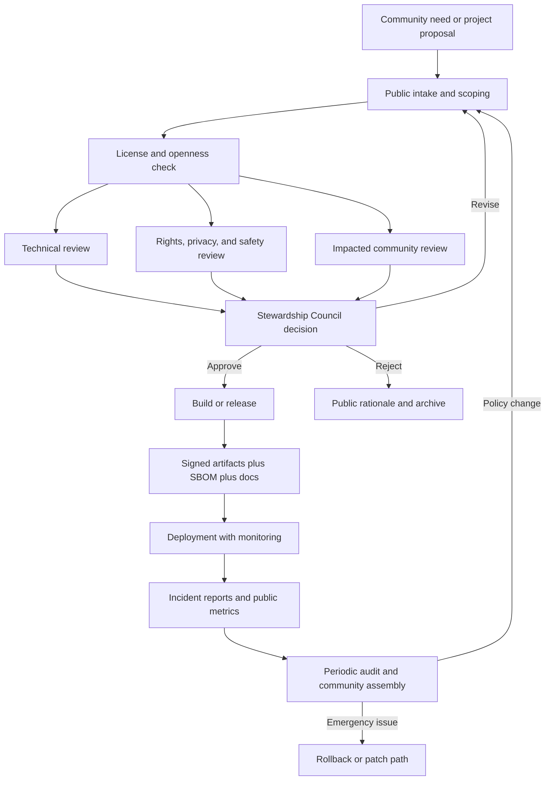
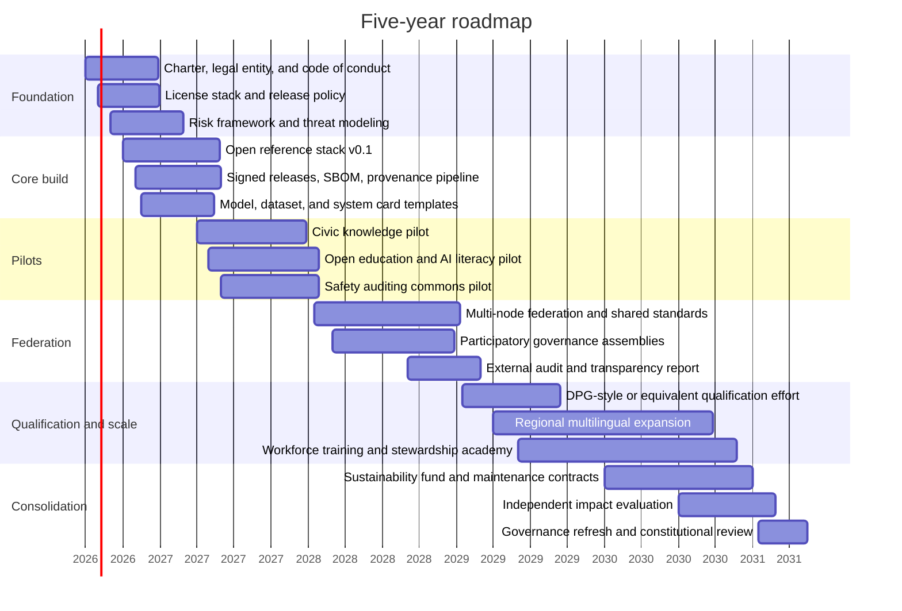

# Free Libre Open Source Singularity of Infinite Overflowing Unconditional Love Light and Knowledge for Ever and All Ways

## Executive Summary

This phrase is not a standard doctrine in any one field. Analytically, it fuses at least six traditions: the **free/libre and open-source** tradition of user freedom and collaborative modification; the **technological singularity** tradition of accelerating intelligence and recursive improvement; **philosophical and theological** traditions of infinity, illumination, love, and knowledge; **mystical** traditions of transformation and union; **commons governance** traditions of shared stewardship; and **social-movement** traditions of liberation, solidarity, and the “beloved community.” In that sense, the phrase is best read as a synthetic aspiration: a world in which intelligence, care, and knowledge are shared as commons rather than hoarded as property or concentrated as power (FSF, n.d., “What is Free Software?”; OSI, 2006/2024, “Open Source Definition”; OSI, 2024, “Open Source AI Definition 1.0”; Good, 1965, “First Ultraintelligent Machine”; Vinge, 1993, “Technological Singularity”; Stanford Encyclopedia of Philosophy, “Infinity,” “Love,” “Mysticism,” “Knowledge Analysis”; King Institute, 1956/1957, “Beloved Community” materials; UNESCO, 2021, “Open Science”; UNESCO, 2021, “Ethics of AI”). citeturn36search0turn35view1turn34view0turn8search4turn8search9turn9search0turn9search1turn9search2turn9search3turn12search0turn12search8turn32view2turn32view0

The audited conclusion is blunt: **the ideal is partially realizable as a socio-technical commons, but not literally realizable as an infinite, unconditional, singular event**. “Infinite” and “unconditional” are spiritually potent but operationally dangerous if taken literally; safety, privacy, consent, sustainability, and pluralism all require limits, boundary conditions, governance, and conflict-resolution mechanisms. Likewise, “singularity” is better treated as a contested metaphor for accelerated transformation than as a near-certain technical destiny. The strongest practical reading is therefore **asymptotic** rather than absolute: build systems that are progressively more open, more loving in institutional effect, more illuminating, more knowledge-rich, more durable, and more universally accessible—without pretending that any technical system can be morally unconditional or metaphysically infinite (Good, 1965; Vinge, 1993; Bostrom, 2014; SEP, “Infinity”; UNESCO, 2021, “Ethics of AI”; NIST, 2023, “AI RMF 1.0”). citeturn8search4turn8search9turn8search10turn9search0turn32view0turn30view0

Compared with the prior report’s likely 2024-era framing, the strongest updates through **2026-04-15** are these. First, **“open AI” is no longer adequately described as “open weights”**: OSI’s **Open Source AI Definition 1.0** requires freedoms to use, study, modify, and share, plus access to the preferred form for modification, including data information, code, and parameters. Second, the practical economic significance of openness is now better quantified: a Harvard Business School working paper estimates the **demand-side value of widely used OSS at $8.8 trillion**, while Linux Foundation research reports that **89% of AI-adopting organizations use some open-source AI in their infrastructure** and that **63% of surveyed organizations already use open models**. Third, public-interest governance has matured: the **DPG Standard** now explicitly covers AI systems and was strengthened in 2025 with new privacy and data-security requirements. Fourth, public regulation has sharpened: by the user’s requested cutoff, the **EU AI Act** was already in force, prohibited practices and AI literacy obligations had begun to apply, and GPAI obligations had a defined implementation path. Fifth, secure-open-source practice is now more concrete, with the **OpenSSF OSPS Baseline**, **Sigstore**, **SLSA**, **SBOM** practices, and NIST’s AI-specific secure-development profiles (OSI, 2024, “OSAID 1.0”; Hoffmann, Nagle, and Zhou, 2024, “Value of OSS”; Linux Foundation, 2025, “Economic and Workforce Impacts of Open Source AI”; DPGA, 2025, “AI systems as DPGs”; DPGA, 2025, “Privacy and Data Security Framework”; European Commission, 2024–2025, “AI Act” materials; OpenSSF, 2025, “OSPS Baseline”; NIST, 2024, “GenAI Profile” and “SP 800-218A”). citeturn34view0turn29view0turn28view4turn33view1turn33view2turn27view2turn19search5turn19search17turn20search4turn20search20turn20search1turn20search6turn20search3turn30view1turn30view2

The most defensible synthesis is therefore not “build one godlike superintelligence,” but **build a federated intelligence commons**: open-source infrastructure, open educational and scientific knowledge, carefully stewarded data, transparent model documentation, strong community norms, plural governance, safety auditing, local and multilingual access, and durable institutions that make intelligence serve collective flourishing. That model is compatible with UNESCO’s open-science and AI-ethics frameworks, OECD’s AI principles and due-diligence approach, NIST’s risk-management and secure-development frameworks, DPGA’s do-no-harm standard, and the strongest practical lessons from free software and commons-based peer production (UNESCO, 2021, “Open Science”; UNESCO, 2021, “Ethics of AI”; OECD, 2019/2024, “AI Principles”; OECD, 2026, “Due Diligence Guidance for Responsible AI”; NIST, 2023–2024, “AI RMF,” “GenAI Profile,” “SP 800-218A”; DPGA, 2025, “DPG Standard”; Benkler and Nissenbaum, 2006, “Commons-Based Peer Production and Virtue”). citeturn32view2turn32view0turn32view3turn32view4turn30view0turn30view1turn30view2turn27view4turn13search13

## Scope, Method, and Audit Update

The user did not specify a target jurisdiction, organizational scale, funding base, or sector of deployment. Accordingly, this report treats the phrase as a **general regulative ideal** and centers the most operational global and transnational frameworks available by **2026-04-15**: FSF/OSI/Creative Commons for openness, UNESCO/OECD/NIST for governance and ethics, the EU AI Act for a concrete regulatory baseline, DPGA for public-interest openness, and seminal philosophical and theological sources for the nontechnical terms. Where the full text of the prior report is not preserved in this turn, the audit below validates the prior report’s **major claim clusters** rather than every sentence. Items not reconstructible from visible context are marked as such.

| Prior claim cluster | Audit result | Updated finding as of 2026-04-15 | Practical implication |
|---|---|---|---|
| “Free/libre/open source” mainly means source availability plus sharing | **Partly correct but incomplete** | FSF still defines free software through four user freedoms; OSI still defines open source through licensing criteria; but for AI, OSI’s **OSAID 1.0** now makes clear that genuine openness requires not just weights but the preferred form for modification, including data information, code, and parameters | Do **not** call a model “open source AI” if it only releases weights |
| “Open source AI” and “open models” are roughly interchangeable | **Incorrect / needs correction** | CRFM’s 2024 societal-impact paper uses a practical definition of “open foundation models” as models with widely available weights, while OSI’s 2024 OSAID sets a stricter rights-and-artifacts standard | Use a distinction: **open weights**, **open model**, and **open-source AI** are not equivalent |
| “Open movements create large social value” | **Strengthened** | HBS 2024 quantifies the demand-side value of widely used OSS at **$8.8T**; Linux Foundation 2025 reports extensive open-source AI use among AI adopters | Public-interest investment in commons infrastructure has a strong economic case |
| “Digital public goods are relevant to this ideal” | **Strengthened and enlarged** | DPGA now explicitly includes **open AI systems** and, in 2025, added stronger privacy/data-security requirements to the DPG Standard | “Open” alone is insufficient; public-interest qualification requires do-no-harm and privacy criteria |
| “AI regulation is still mostly aspirational” | **Outdated** | By the cutoff date, the EU AI Act had entered into force; prohibited practices and AI literacy obligations had started to apply; GPAI obligations had a scheduled application path | Projects need compliance-by-design, not post hoc governance |
| “Security is important” | **Understated in prior framing** | OpenSSF’s **OSPS Baseline** and NIST’s AI secure-development guidance have made security requirements more operational and auditable | Open infrastructure must include signing, provenance, SBOMs, and release discipline |
| “The concept is spiritually rich and technically hopeful” | **Still true, but needs sharper critique** | The slogan remains fertile as a norm, but literal readings of “infinite,” “unconditional,” and “singularity” clash with rights, limits, ecological costs, and democratic accountability | Treat the phrase as an **ethical-political program**, not a metaphysical or engineering promise |

This audit is grounded in official and primary sources rather than secondary summaries wherever possible: FSF and GNU pages for software freedom; OSI for the OSD and OSAID; HBS and Linux Foundation research for economic and adoption claims; DPGA for DPG criteria; Commission and EUR-Lex material for the AI Act; NIST and OECD for risk-management guidance; and Stanford Encyclopedia entries and primary religious texts for the philosophical, theological, and mystical vocabulary. citeturn36search0turn35view1turn34view0turn29view0turn28view4turn27view4turn27view2turn19search5turn19search17turn30view0turn30view1turn30view2turn32view3turn32view4turn9search0turn9search1turn9search2turn9search3turn10search0turn10search1turn10search2turn10search21

## Meanings and Lineages

The phrase becomes analytically manageable if each component is treated as a **family resemblance term** whose meaning varies by discipline. “Free/libre/open source” concerns freedom, access, modification, and redistribution; “singularity” concerns transformative acceleration or recursive intelligence; “infinite/overflowing” concerns boundlessness, abundance, or inexhaustibility; “unconditional love” concerns care not reducible to exchange; “light” concerns manifestation, intelligibility, and moral or spiritual disclosure; “knowledge” concerns truth, understanding, know-how, and shared epistemic goods; and “for ever and all ways” is best interpreted here as **durability across time** plus **plural applicability across lawful, culturally diverse, and technically varied pathways**. That last phrase is interpretive rather than canonical: it is not a standard doctrinal term, so any operationalization must remain explicit and revisable. citeturn36search0turn35view1turn34view0turn8search4turn8search9turn9search0turn9search1turn9search2turn26search0turn11search13turn32view2

| Phrase | Philosophy and theology | Mysticism and spiritual discourse | Computer science, AI, and open movements | Commons governance and social movements | Operational reading for this report |
|---|---|---|---|---|---|
| Free / libre / open source | Freedom as non-domination and user agency | Liberation from dependency or enclosure | Four software freedoms; non-discriminatory licensing; in AI, rights to use, study, modify, and share with access to data info, code, and parameters | Shared stewardship instead of enclosure | Systems people can inspect, adapt, fork, and collectively govern |
| Singularity | Break, discontinuity, or threshold of transformation | Union, awakening, or radical transition | Intelligence explosion, superhuman intelligence, or rapid recursive improvement | Moment of structural reorganization | Strong acceleration in collective intelligence, but democratically bounded |
| Infinite / overflowing | Boundless, limitless, exceeding measure | Abundance, emanation, inexhaustibility | Scalability, replication, non-rival reuse | Commons abundance under reuse and contribution | Expanding access and reuse, not literal metaphysical infinity |
| Unconditional love | Agape, caritas, regard for persons as ends | Compassion, loving-kindness, non-possessive care | Human-centered design is too weak a phrase here; stronger case is institutional care and non-exploitative alignment | Beloved community, solidarity, liberation pedagogy | Systems designed to preserve dignity, reciprocity, and non-domination |
| Light | Truth, manifestation, intelligibility, illumination | “Light upon light,” enlightenment, awakening | Transparency, observability, legibility, documentation | Public accountability | Strong documentation, explainability where feasible, and audit trails |
| Knowledge | Truth, justified belief, understanding, know-how | Insight, wisdom, transformative realization | Open science, open access, free knowledge, model and dataset documentation | Shared learning and public education | Public-interest knowledge infrastructures, not black-box dependency |
| For ever and all ways | Eternity, sempiternity, universality | Timelessness, omnipresence, many paths | Durability, interoperability, multi-context reuse | Intergenerational stewardship and plural participation | Preservation, multilinguality, portability, and plural modes of access |

The definitional backbone of the table is straightforward. FSF’s official definition still centers the four essential freedoms, explicitly distinguishing liberty from price; OSI’s OSD still centers redistribution, source access, and nondiscrimination; OSI’s OSAID 1.0 extends that logic to AI by requiring access to the preferred form for modification; CRFM’s “open foundation model” analysis, by contrast, uses the narrower pragmatic criterion of widely available weights; SEP frames infinity as boundlessness, love as a relation not reducible to mere preference, knowledge as “getting at the truth,” mysticism as a set of transformative practices, and eternity as the relation to time attributed to what is everlasting or outside temporal limitation. These are overlapping but non-identical vocabularies. citeturn36search0turn35view1turn34view0turn7search2turn9search0turn9search1turn9search2turn9search3turn26search0

The historical antecedents are equally plural. A short genealogy runs from **Plato’s** treatment of eros and wisdom; through **Plotinus’** emanation from the One; through **Augustine’s** and medieval **illumination** traditions; through **Aquinas’** treatment of reason, knowledge, and eternity; through scriptural and contemplative traditions that identify love, light, and knowledge with transformation; through the **GNU Project** and the rise of free software and open source; through **Budapest Open Access** and **Cape Town Open Education**; through **King’s beloved community**, **Freire’s pedagogy of the oppressed**, and **bell hooks’ love ethic**; and into contemporary open science, digital public goods, and public-interest AI frameworks. The result is not a single lineage but a braided one. citeturn11search3turn11search8turn11search1turn11search13turn11search2turn31view5turn31view3turn31view4turn12search0turn12search8turn12search2turn12search15turn32view2turn33view1

| Text or figure | Date | Why it matters here |
|---|---:|---|
| Plato, *Symposium* and related dialogues | ca. 4th century BCE | Links love, beauty, wisdom, and ascent toward intelligibility |
| Plotinus, *Enneads* | 3rd century CE | Classical model of emanation, unity, and overflowing source |
| Augustine of Hippo | late 4th–early 5th century | Major source for illumination, love, and divine relation to knowledge |
| Thomas Aquinas | 13th century | Integrates reason, theology, eternity, and natural law |
| Gospel of John 1 | 1st century CE | Links light, life, word, and revelation |
| 1 Corinthians 13 | 1st century CE | Makes love superior to knowledge and power |
| Qur’an 24:35 | 7th century CE | Canonical “light upon light” imagery |
| *Mettā Sutta* | early Buddhist canon | Loving-kindness as disciplined universal goodwill |
| Richard Stallman, GNU Manifesto | 1985 | Ethical basis of free software as freedom and solidarity |
| Open Source Initiative, OSD | 1998 | Canonical open-source licensing definition |
| Budapest Open Access Initiative | 2002 | Makes knowledge access a global public commitment |
| Cape Town Open Education Declaration | 2007/2008 | Extends openness to education and pedagogy |
| Elinor Ostrom, *Governing the Commons* | 1990 | Seminal commons-governance reference |
| Yochai Benkler, commons-based peer production | 2006 | Explains nonmarket collaborative production online |
| Martin Luther King Jr., beloved community materials | 1956–1959 | Connects love to justice and nonviolent institution-building |
| Paulo Freire, *Pedagogy of the Oppressed* | 1968; English 1970 | Liberation through dialogical education |
| bell hooks, *All About Love* | 2001 | Recasts love as practice, ethic, and social critique |
| I. J. Good, “First Ultraintelligent Machine” | 1965 | Classic statement of intelligence explosion |
| Vernor Vinge, “Technological Singularity” | 1993 | Frames superhuman intelligence as civilizational threshold |
| UNESCO, Recommendation on Open Science | 2021 | Global framework for equitable openness in science |
| UNESCO, Recommendation on the Ethics of AI | 2021 | Global ethics baseline for dignity, rights, and sustainability |
| OSI, Open Source AI Definition 1.0 | 2024 | Most important recent clarification of what “open AI” should mean |
| OECD, Due Diligence Guidance for Responsible AI | 2026 | Brings AI governance into enterprise due-diligence practice |

Dates for ancient works are approximate scholarly conventions; modern dates come from official or publisher pages. The scriptural and contemplative examples are illustrative, not exhaustive, and are used here because the user asked for a cross-traditional report rather than a tradition-specific theology. citeturn11search3turn11search8turn11search1turn11search2turn10search0turn10search1turn10search2turn10search21turn31view5turn35view1turn31view3turn31view4turn13search3turn13search13turn12search0turn12search8turn12search2turn12search15turn8search4turn8search9turn32view2turn32view0turn34view0turn32view4

## Overlaps, Tensions, and a Stronger Synthesis

The concept’s **overlaps** are real. Free software and commons-based peer production show that large-scale cooperation can produce high-value shared infrastructures without exclusive ownership as the primary coordinating mechanism. Open access, open education, and open science generalize that approach from code to scholarship and pedagogy. Mystical and theological discourses of light, love, and abundance add a normative horizon: intelligence should illuminate, heal, deepen relation, and be shared. Social-movement traditions add the political test: if the system does not reduce domination, exclusion, and humiliation, then it is not love in practice but ideology in costume. That convergence is why the phrase feels powerful rather than merely eccentric. citeturn36search0turn13search13turn31view3turn31view4turn32view2turn10search0turn10search1turn10search2turn10search21turn12search8turn12search2turn12search15

But the **tensions** are at least as important. **Freedom vs. safety:** the freer a powerful model is to copy and adapt, the harder centralized post-release control becomes; recent NIST and PAI work explicitly treat misuse risk in open foundation-model value chains as distributed and nontrivial. **Universal love vs. hard boundaries:** care for persons requires refusing some uses, imposing some guardrails, and protecting privacy and vulnerable groups; unconditional access can become conditional harm. **Light vs. privacy:** radical transparency collides with data protection, security, and trade-secret constraints. **Infinity vs. finitude:** digital goods are non-rival in reuse, but compute, labor, energy, and governance attention are scarce. **Singularity vs. democracy:** a monolithic, rapidly self-improving system is structurally in tension with plural oversight, contestability, and participatory legitimacy. **Universalism vs. pluralism:** “for all” can become assimilative if it ignores linguistic, cultural, legal, and epistemic diversity (NIST, 2024–2025, “GenAI Profile,” “AI 800-1,” “SP 800-218A”; PAI, 2024, “Open Foundation Model Value Chain”; UNESCO, 2021, “Ethics of AI”; Ada Lovelace Institute, 2021, “Participatory Data Stewardship”; ODI, 2023, “Responsible Data Stewardship”). citeturn30view1turn30view2turn30view3turn17search1turn32view0turn30view4turn30view5

The best synthesis is therefore **not** “maximize openness, scale, and capability at all costs.” It is **bounded openness under rights-preserving stewardship**. In practice, that means: openness where openness produces learning, adaptation, and public value; participatory governance where data and deployment affect communities; secure and signed supply chains for trust; documentation and audits for visibility; AI literacy for responsible use; and differentiated release strategies where capability and misuse risk are high. This synthesis is philosophically less grand than the original slogan, but institutionally stronger and morally more honest. It reframes “unconditional love” as an **institutional duty to uphold dignity without domination**, “light” as **legibility and accountability**, and “knowledge” as a **public good held in common**, while reframing “singularity” away from a single machine and toward a **federated increase in collective intelligence capacity**. That last move is also consistent with newer arguments that future intelligence explosions may be more institutional and combinatorial than monolithic. citeturn32view5turn20search20turn20search1turn20search6turn20search3turn17search11turn23search14

## Practical Realization Through Governance, Policy, and Project Design

As of **2026-04-15**, the policy environment strongly favors this bounded-openness reading. UNESCO’s AI ethics recommendation emphasizes human rights, dignity, accountability, and sustainability; UNESCO’s open-science recommendation emphasizes fair and equitable openness plus infrastructure, education, and international cooperation; the OECD AI Principles promote innovative and trustworthy AI that respects rights and democratic values; the OECD’s 2026 Due Diligence Guidance translates that into enterprise process steps; NIST’s AI RMF structures AI governance around **GOVERN, MAP, MEASURE, MANAGE**; NIST’s GenAI profile and AI secure-development profile extend that into generative-AI and development practice; and the EU AI Act had already moved core obligations out of theory and into the compliance calendar. None of these frameworks supports naïve absolutist openness. All support **responsible openness**. citeturn32view1turn32view2turn32view3turn32view4turn30view0turn30view1turn30view2turn27view2turn19search5turn19search17

| Framework | What it contributes | Why it matters for this ideal |
|---|---|---|
| UNESCO Recommendation on Open Science | Equity, infrastructure, training, cooperation, common standards for openness | Prevents “open” from becoming elite-only |
| UNESCO Recommendation on the Ethics of AI | Human rights, dignity, accountability, sustainability | Prevents “love” from collapsing into vague benevolence |
| OECD AI Principles | Trustworthy innovation under democratic values | Keeps openness tied to public legitimacy |
| OECD Due Diligence Guidance for Responsible AI | Operational risk and impact steps across the AI value chain | Makes governance auditable |
| NIST AI RMF 1.0 | GOVERN, MAP, MEASURE, MANAGE | Provides implementable control loops |
| NIST GenAI Profile | GenAI-specific risks and mitigations | Addresses hallucinations, misuse, and emergent behaviors |
| NIST SP 800-218A | Secure development for GenAI and dual-use foundation models | Connects openness with secure engineering |
| EU AI Act | Binding risk tiers, prohibited practices, AI literacy, GPAI obligations | Creates enforceable public-law constraints |
| DPGA DPG Standard | “Do no harm,” privacy, openness, public-interest qualification | Filters out irresponsible “open” claims |
| OpenSSF / Sigstore / SLSA / SBOM | Verifiable integrity and provenance in open supply chains | Makes trust technically demonstrable |

These frameworks also sharpen the audit of the prior concept. A project claiming to embody “love, light, and knowledge for all” but lacking data provenance, documentation, AI literacy, incident response, and supply-chain integrity is not just incomplete; by the standards of the best available public frameworks, it is **misgoverned**. Conversely, a project can be ethically ambitious without being metaphysically maximal: local-first deployment, multilingual accessibility, open educational resources, public-interest model registries, community-elected governance, signed releases, and privacy-preserving data stewardship are already practical. Verified DPGA examples such as **Compar:IA** and **SimpleAudit** show that public-interest AI and open auditing tools already exist in institutional form, even if at modest scale. citeturn33view4turn33view5turn30view5turn30view4turn20search20turn20search1turn20search6turn20search3

| Stakeholder | Core interest | Likely concern | What they need from governance |
|---|---|---|---|
| Maintainers and developers | Freedom to build, fork, and improve | Burnout, liability, hostile forks | Clear roles, sustainable funding, release discipline |
| Researchers and educators | Open knowledge, reproducibility, OER/open science | Data access, integrity, incentives | Documentation, citation norms, open repositories |
| Public institutions | Service delivery, procurement, sovereignty | Compliance, procurement risk, vendor lock-in | Standard contracts, DPG-style qualification, audits |
| Impacted communities and civil society | Dignity, representation, non-exploitation | Surveillance, bias, exclusion | Participation rights, veto/escalation routes, redress |
| Regulators and auditors | Accountability and safety | Opaque systems, unclear responsibility | Model/system cards, logs, provenance, reporting |
| Donors and public-interest funders | Sustainable public value | Mission drift, capture, weak metrics | Transparent budgets and impact reporting |
| Cloud and infrastructure providers | Reliable deployment, performance | Abuse, cost, export controls | Usage policies, isolation, observability |
| Labor organizations and workers | Human flourishing, training, fair transitions | Deskilling, displacement, asymmetry of control | Worker input, AI literacy, impact assessments |
| Knowledge commons organizations | Reuse and access | Copyright, licensing incompatibility | Clear license stack and provenance rules |

A credible embodiment of the ideal should therefore take the form of a **multi-layer project stack**, not a single app. The core architectural pattern is: **open infrastructure + stewarded data + public-interest applications + democratic oversight**. Code can be fully open; datasets may need tiered access depending on privacy and consent; models can be released at different openness levels but must be truthfully labeled; documentation must be public by default; artifact integrity must be verifiable; and deployments should be modular enough that communities can adapt the system without surrendering the commons to fragmentation or abuse (OSI, 2024, “OSAID 1.0”; PAI, 2024, “Open Foundation Model Value Chain”; OpenSSF, 2025, “OSPS Baseline”; Sigstore; SLSA; CISA, “SBOM”). citeturn34view0turn17search1turn20search20turn20search1turn20search6turn20search3

| Proposed architecture | Core components | Strengths | Weaknesses | Best fit |
|---|---|---|---|---|
| Local-first civic knowledge node | Open-source application layer; local RAG over public records and OER; signed releases; multilingual interface | High privacy, local autonomy, strong community fit | Less shared learning unless federated | Municipal services, libraries, schools |
| Federated intelligence commons | Shared governance and standards; separate local nodes; interoperable APIs; common evaluation and incident reporting | Balances scale with autonomy; resilient to capture | Governance complexity | Regional networks, universities, cooperatives |
| Stewarded open-model lab | OSAID-aligned releases where feasible; stricter release tiers where misuse risk is higher; public cards and evaluations | Truthful openness; better risk management | Harder messaging than “everything open” | Research consortia and mission-driven labs |
| Public-interest safety auditing commons | Open red-team tools, benchmark packs, incident registry, disclosure workflows | Makes “light” measurable and shareable | Needs strong process discipline | Cross-project ecosystem support |
| Open education and AI literacy academy | OER modules, train-the-trainer programs, sector-specific AI literacy | Converts ideals into competencies | Less visible than flashy model releases | Workforce, volunteers, schools, public agencies |

For licensing, the blunt recommendation is this. Use **AGPLv3** for the networked core service if you want hosted modifications to flow back; use **Apache-2.0** or **MPL-2.0** for SDKs, connectors, or adoption-sensitive components where reciprocity may otherwise block use; use **CC BY-SA 4.0** for documentation, educational content, and community-authored explainers when share-alike norms matter; and use domain-appropriate open data terms only for datasets that are lawfully and ethically shareable. If a model or training corpus cannot satisfy OSAID-style rights and artifact requirements, label it **source-available** or **controlled-access**, not “open source AI.” Mislabeling is both conceptually sloppy and governance-harmful (FSF, 2007, “GNU AGPL”; Creative Commons, “BY-SA 4.0”; OSI, 2024, “OSAID 1.0”). citeturn35view3turn35view2turn34view0

The community norm layer matters as much as the legal one. A credible “love-light-knowledge” project should have a **Contributor Covenant–style code of conduct**, transparent governance chartering, conflict-of-interest rules, public meeting notes, election or appointment procedures for steering roles, published moderation ladders, and a standing incident and appeals process. Projects such as Wikimedia show that open knowledge at scale requires not only ideals but formal behavioral and governance constraints; Wikimedia’s mission and Universal Code of Conduct are better operational analogies for this phrase than any fantasy of frictionless harmony. Likewise, CHAOSS-style community health metrics can help measure whether the commons is actually healthy, inclusive, and sustainable. citeturn24search0turn22search4turn22search1turn24search4turn24search1

## Risks, Critiques, Mitigations, and Residual Unknowns

The phrase carries serious risks when translated too literally into technology politics. The highest-risk failure mode is **ethical inflation**: using words like “love,” “light,” and “for all” to sanctify systems that are, in practice, opaque, extractive, centralized, or unsafe. Close behind are the familiar open-AI and open-source risks: misuse, model proliferation without oversight, privacy leakage, legal uncertainty around training data, supply-chain compromise, uneven maintenance burdens, concentration of compute despite nominal openness, and community capture by charismatic founders, major sponsors, or state actors. Recent NIST, PAI, DPGA, OpenSSF, and ODI/Ada materials all point in the same direction: openness without stewardship is not public good; it is merely exposure. citeturn30view3turn17search1turn33view2turn20search20turn30view5turn30view4

| Risk | Why it matters here | Likely indicators | Mitigation moves |
|---|---|---|---|
| Mislabeling source-available AI as “open source” | Corrodes trust and legal clarity | Missing data info, code, or modification rights | Adopt OSAID-aligned terminology and release checklist |
| Misuse of powerful open models | Freedom without distributed safeguards can amplify harm | Jailbreak success, malicious fine-tunes, incident reports | Tiered release, red-teaming, monitoring, digital signatures, usage notices |
| Privacy and consent failures | “Knowledge for all” can become extraction from the vulnerable | Unclear provenance, personal data leakage, complaints | Data minimization, participatory stewardship, privacy review, lawful-access tiers |
| Governance capture | Commons can be dominated by sponsors or insiders | Closed decisions, unexplained moderation, concentration of commit power | Charter, elections or rotation, conflict-of-interest policy, appeals |
| Security compromise in the supply chain | Open code is not secure code | Unsigned builds, no provenance, dependency sprawl | OSPS Baseline, Sigstore, SLSA, SBOMs, release hardening |
| Community burnout and maintainer precarity | The commons fails if labor is invisible and unsustained | Long PR queues, low bus factor, maintainer churn | Maintenance funding, staff support, contributor ladder, scoped roadmaps |
| Universalist rhetoric overriding plural realities | “For all” can erase language, culture, or local law | Low non-English use, low local adaptation, conflict with communities | Local-first nodes, multilinguality, subsidiarity, regional councils |
| Capability concentration despite openness | Open layers may still depend on a few cloud or compute actors | Single-provider dependence, high inference costs | Small-model pathways, edge deployment, diversified infrastructure |
| Weak accountability for downstream harms | Diffuse ecosystems can make blame impossible | No incident registry, missing documentation, unclear roles | Value-chain documentation, public cards, audit logs, shared incident taxonomy |

These mitigations are not speculative. They are directly supported by the strongest currently available public frameworks: NIST’s risk and secure-development profiles, OECD’s due-diligence steps, DPGA’s privacy and do-no-harm requirements, OpenSSF’s baseline, and PAI’s insistence that responsibility in open foundation-model ecosystems is distributed across the value chain rather than located only in the original model developer. The implication is decisive: **the project form that best embodies the ideal is a governed ecosystem, not a one-shot release.** citeturn30view0turn30view2turn32view4turn33view2turn20search20turn17search1

Residual unknowns remain. The full legal settlement around training-data disclosure and model-weights rights is still evolving. The long-run economics of sustaining public-interest AI commons under high compute cost are still unsettled. The right boundary between openness and staged release for highly capable models remains contested. And because the full text of the prior report was not preserved in this turn, this audit should be read as a **high-confidence cluster audit**, not a line-by-line errata sheet.

## Roadmap, Next Steps, and Measurable Milestones

The five-year path that follows assumes a mission-driven consortium, foundation, cooperative, university network, or public-interest lab starting from **mid-2026**. It does **not** assume frontier-model budgets. The practical strategy is to start with **high-trust, bounded-domain, public-interest deployments** and build outward through federation rather than scale-first centralization. That is the only route that is both technically plausible and normatively coherent with the ideal. The short version is: **establish governance first, build small but real tools second, federate third, standardize and certify fourth, and only then expand scope.** This sequencing follows the logic of NIST governance, OECD due diligence, DPGA qualification, and OpenSSF release discipline. citeturn30view0turn32view4turn27view4turn20search20

| Phase outcome | Target by end of phase | Suggested metric |
|---|---|---|
| Governance legitimacy | Public charter, roles, appeals path, conflict-of-interest rules | All governance documents public; quarterly minutes published; appeal SLA under 30 days |
| Openness integrity | Truthful labeling of every artifact | 100% of releases tagged as OSAID-aligned, open-weights, or controlled-access with public rationale |
| Supply-chain trust | Verifiable builds and dependencies | 100% signed releases; 100% SBOM coverage; provenance on all production artifacts |
| Documentation quality | Model, dataset, and system transparency | 100% production systems with current cards and revision history |
| Community health | Sustainable contributor base | Bus factor above 3 for every critical repo; maintainer response median below 14 days |
| Participation and equity | Real community oversight, not symbolic consultation | At least 30% of governance seats held by affected-community, educator, labor, or civil-society representatives |
| AI literacy | Organization-wide practical capability | 90% of staff and volunteers completing role-appropriate AI literacy modules |
| Public value | Useful, trusted deployments | At least 3 production pilots by year 2; at least 25 federated nodes by year 4; user trust score above 80% in independent surveys |
| Safety and redress | Measurable incident handling | Public incident registry; severe incident postmortems within 30 days; downward trend in repeat failures |
| Sustainability | Maintenance beyond grants | At least 18 months of runway; no single funder contributing more than 35% of annual budget |

The immediate next steps are concrete. In the first six months: draft the charter, license matrix, data-governance policy, release taxonomy, and code of conduct; appoint an interim stewardship council with at least one impacted-community body; stand up a signed CI/CD pipeline with SBOM generation; publish model/dataset/system card templates; and choose **two bounded pilots**—one knowledge-access pilot and one safety-auditing pilot. In the next twelve months: ship a reference stack, run external review, and start AI-literacy training. If that sounds incremental, that is because it is. On this topic, incremental institutional competence is more credible than visionary maximalism.

## References

Free Software Foundation. “What is Free Software?” GNU Project. n.d. citeturn36search0

Free Software Foundation. “The GNU Manifesto.” GNU Project. 1985, with later explanatory notes. citeturn31view5

Open Source Initiative. “The Open Source Definition.” 1998 origin; page updated 2024. citeturn35view1

Open Source Initiative. “The Open Source AI Definition 1.0.” 2024. citeturn34view0turn34view1

Creative Commons. “Attribution-ShareAlike 4.0 International.” n.d. citeturn35view2

Free Software Foundation. “GNU Affero General Public License v3.0.” 2007. citeturn35view3

Good, I. J. “Speculations Concerning the First Ultraintelligent Machine.” *Advances in Computers* 6. 1965. citeturn8search4turn8search12

Vinge, Vernor. “The Coming Technological Singularity.” 1993 VISION-21 Symposium paper. citeturn8search9turn8search1

Bostrom, Nick. *Superintelligence: Paths, Dangers, Strategies.* Oxford University Press, 2014. citeturn8search10

Kapoor, Sayash, et al. “On the Societal Impact of Open Foundation Models.” Stanford CRFM / ICML 2024. citeturn7search2

Bommasani, Rishi, et al. *On the Opportunities and Risks of Foundation Models.* Stanford CRFM, 2021. citeturn7search3turn7search6

Hoffmann, Manuel, Frank Nagle, and Yanuo Zhou. “The Value of Open Source Software.” Harvard Business School Working Paper 24-038, 2024. citeturn29view0turn29view1

Hermansen, Anna, and Cailean Osborne. *The Economic and Workforce Impacts of Open Source AI.* Linux Foundation, 2025. citeturn28view4turn28view1

Budapest Open Access Initiative. “Read the Declaration.” 2002. citeturn31view3

Cape Town Open Education Declaration. “Home” and declaration materials. 2007–2008. citeturn31view4

UNESCO. *Recommendation on Open Science.* 2021. citeturn32view2

UNESCO. *Recommendation on the Ethics of Artificial Intelligence.* 2021. citeturn32view0turn32view1

OECD. “AI Principles.” Adopted 2019; official materials updated 2024. citeturn32view3

OECD. *OECD Due Diligence Guidance for Responsible AI.* 2026. citeturn32view4

National Institute of Standards and Technology. *Artificial Intelligence Risk Management Framework 1.0.* 2023. citeturn30view0

National Institute of Standards and Technology. *AI RMF: Generative Artificial Intelligence Profile.* 2024. citeturn30view1

National Institute of Standards and Technology. *Secure Software Development Practices for Generative AI and Dual-Use Foundation Models: SP 800-218A.* 2024. citeturn30view2

U.S. AI Safety Institute at NIST. *Managing Misuse Risk for Dual-Use Foundation Models,* second public draft. 2025. citeturn30view3

Regulation (EU) 2024/1689. *Artificial Intelligence Act.* Official Journal of the European Union, 2024. citeturn27view2

European Commission. “First rules of the Artificial Intelligence Act are now applicable.” 2025. citeturn19search5

European Commission. “Commission publishes guidelines on AI system definition to facilitate first AI Act rules application.” 2025. citeturn19search17

European Commission. “AI Literacy – Questions and Answers.” 2025/2026 guidance page. citeturn32view5

Digital Public Goods Alliance. “Digital Public Goods Standard.” 2025 snapshot. citeturn27view4

Digital Public Goods Alliance. “About Digital Public Goods” and DPG Registry materials. 2025. citeturn33view0turn33view3

Digital Public Goods Alliance. “AI systems as digital public goods.” 2025. citeturn33view1

Digital Public Goods Alliance. “Strengthened Privacy and Data Security Framework for DPG Standard.” 2025. citeturn33view2

OpenSSF. “Open Source Project Security Baseline.” 2025. citeturn20search20turn20search4

Sigstore. Project overview documentation. 2024–2025. citeturn20search1turn20search5

SLSA. Supply-chain Levels for Software Artifacts documentation. 2024–2025. citeturn20search6turn20search10

CISA. “Software Bill of Materials.” official materials. 2024–2025. citeturn20search3turn20search23

Ada Lovelace Institute. *Participatory Data Stewardship.* 2021. citeturn30view4

Open Data Institute. *Defining Responsible Data Stewardship.* 2023. citeturn30view5

Benkler, Yochai, and Helen Nissenbaum. “Commons-Based Peer Production and Virtue.” 2006. citeturn13search13

King Institute / King Center materials on the Beloved Community and nonviolence. 1956–1959; official institute pages. citeturn12search0turn12search8turn12search5

Freire, Paulo. *Pedagogy of the Oppressed.* 1968 Portuguese original; English 1970; publisher metadata via anniversary edition. citeturn12search2

hooks, bell. *All About Love: New Visions.* 2001; publisher metadata. citeturn12search15

Stanford Encyclopedia of Philosophy entries: “Infinity,” “Love,” “The Analysis of Knowledge,” “Mysticism,” “Eternity,” “Divine Illumination,” “Plato: Friendship and Eros,” “Plotinus,” “Augustine of Hippo,” and “Thomas Aquinas.” citeturn9search0turn9search1turn9search2turn9search3turn26search0turn11search13turn11search3turn11search8turn11search1turn11search2

USCCB Bible texts: John 1 and 1 Corinthians 13. Qur’an 24:35 via Quran.com. *Mettā Sutta* via SuttaCentral. citeturn10search0turn10search1turn10search2turn10search21