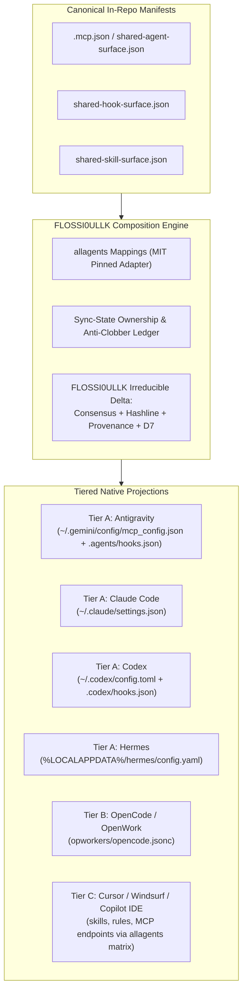

# ADR-18 Reuse Inquiry & Upgrade Plan: Universal Multi-Agent Materializer

```yaml
id: "adr18-materializer-reuse-inquiry"
title: "Multi-Agent Surface Materializer — Prior-Art Reuse Inquiry & Upgrade Plan (v2.1)"
date: "2026-08-25"
governed_by: "ADR-18 (Prior-Art & Reuse Gate)"
tier: 2
verdict: "compose"
decision_status: "+0.5 Conditional Proceed (Phase 2 hardening active; Phase 3 strictly gated)"
truth_status: "Specified plan with partial local verification"
candidates_evaluated:
  - id: "allagents"
    upstream_url: "https://github.com/EntityProcess/allagents"
    license: "MIT"
    stability: "Stable (v1.13.4 on npm/GitHub)"
    truth_status: "Specified (MIT upstream confirmed; commit SHA pinning required for Phase 3)"
    verdict: "adopt/compose (client matrix, sync-state ownership, MCP proxy)"
  - id: "agentplugins"
    upstream_url: "https://github.com/agentplugins/agent-plugins-spec"
    license: "Apache-2.0"
    stability: "Standardized (Specification v1.0.0; multi-vendor governed by Amazon, Cursor, Microsoft, OpenAI, Vercel, Google)"
    truth_status: "Specified (standardized specification confirmed)"
    verdict: "adopt (manifest & plugin schemas)"
  - id: "dotagents"
    upstream_url: "https://github.com/getsentry/dotagents"
    license: "Apache-2.0"
    stability: "Beta (Sentry documents as active beta with expected breaking changes)"
    truth_status: "Specified (beta status acknowledged; adapter-confined adoption only)"
    verdict: "adopt (.agents/ root layout convention)"
  - id: "bespoke_floss_scripts"
    source: "FLOSS/scripts/materialize_shared_*.py"
    truth_status: "Specified / Locally verified (active in workspace)"
    verdict: "compose (preserves FLOSSI0ULLK Layer 4.5 consensus & provenance delta)"
```

---

## 1. Capability Statement & Scope
> **Capability**: Project and synchronize a canonical specification of skills, lifecycle hooks, MCP servers, and workspace rules across heterogeneous AI agent harnesses (Claude Code, Antigravity/AGY, Codex, OpenCode/OpenWork, Copilot, Hermes, Cursor, etc.) while preserving FLOSSI0ULLK's Layer 4.5 consensus gateway, signed-gradient voting $[-1.0, +1.0]$, hashline write-verification, D7 Spec-Gate, and BLAKE3 provenance invariants.

---

## 2. Multi-Model Audit Synthesis & Dispositions

Across the multi-model audit cycle (incorporating independent analysis from Grok 4.6, Claude Sonnet 5, and Kimi K3), the following critical corrections have been reconciled in v2.1:

| Dimension | Audit Finding | Disposition in v2.1 |
| :--- | :--- | :--- |
| **Upstream Metadata** | `agentplugins` URL had path typo; `dotagents` beta volatility unlisted. | Corrected repo to `agentplugins/agent-plugins-spec`; documented `dotagents` beta status in candidate matrix. |
| **Tier Consistency** | Codex and Copilot tier assignments conflicted between table and flowchart. | Reconciled: **Codex is Tier A** (Enforcing via `.codex/hooks.json`); **Copilot CLI is Tier B** (Observing); **Copilot IDE / Cursor / Windsurf is Tier C** (Surface-only). |
| **Truth Labels** | "Complete & Verified" overclaimed runtime blocking behavior. | Downgraded to **Specified / Locally Stabilized**; runtime enforcement requires fixture tests. |
| **Hook Semantics** | `PostToolUse` mislabeled as "Enforce"; fail-open/closed paths undefined. | Recast `PostToolUse` as **Record / Verify / Recover**; defined explicit path classification for fail-open vs fail-closed. |
| **Testing Checklist** | Rollback testing promised in narrative but omitted from Phase 2 checkboxes. | Added **Rollback Verification** ($FLOSS_AGENT_DIR checkpoint restore) as explicit Phase 2 exit criterion. |

---

## 3. Proposed Target Capability Tiers

To prevent false assurance, targets are classified into explicit capability tiers:

```
┌────────────────────────────────────────────────────────────────────────────────────────┐
│                               Target Capability Tiers                                  │
├───────────────────┬───────────────────────────────────────────┬────────────────────────┤
│ Tier A: Enforcing │ Blocking Pre/Post Tool Hooks              │ Antigravity (AGY)      │
│                   │ Hashline Verification & Consensus Gate    │ Claude Code            │
│                   │ Strict Fail-Closed Gating on Canon/Code   │ Codex (.codex/hooks)   │
│                   │ Deterministic Pre-Write Checkpoints       │ Hermes                 │
├───────────────────┼───────────────────────────────────────────┼────────────────────────┤
│ Tier B: Observing │ Non-blocking Telemetry & Logging          │ OpenCode / OpenWork    │
│                   │ BLAKE3 Provenance Packet Emission         │ Gemini CLI Legacy      │
│                   │ Advisory Spec-Gate Warnings               │ Copilot CLI            │
├───────────────────┼───────────────────────────────────────────┼────────────────────────┤
│ Tier C: Surface   │ Skills Projection (`.agents/skills/`)     │ Cursor                 │
│                   │ Rules Projection (`AGENTS.md`, `rules/`)  │ Windsurf               │
│                   │ Read-Only MCP Server References           │ VS Code / Roo / Kimi   │
├───────────────────┼───────────────────────────────────────────┼────────────────────────┤
│ Tier D: Excluded  │ Unstable or incompatible schema           │ (Evaluated on demand)  │
│                   │ No safe translation path                  │                        │
└───────────────────┴───────────────────────────────────────────┴────────────────────────┘
```

> [!IMPORTANT]
> **Enforcement Boundary**: Layer 4.5 consensus gating is claimed **only** on Tier A harnesses. Tier B receives audit provenance; Tier C receives skills and static context without claiming runtime invariant enforcement.

---

## 4. Single-Writer Ownership & Execution Contract

### A. Ownership Ledger (`sync-state.json`)
- **Single Authority**: `flossi0ullk-materializer` is the sole authorized writer for managed configuration regions.
- **Region Boundaries**: Managed blocks (e.g. `mcpServers.flossiullk-*`, `hooks.flossi0ullk-*`) are strictly isolated. Unmanaged user keys and local overrides are preserved byte-for-byte.
- **Conflict Handling**: User edits inside managed regions trigger a visible conflict warning during `--check` rather than silent overwriting.

### B. Path Classification & Fail Semantics
To make fail-open vs fail-closed behavior operational:
- **Substrate / Canon Paths (Fail-Closed on Error/Timeout)**:
  - `/packages/**` (Implementation code)
  - `/docs/adr/**` (Architecture Decision Records)
  - `/docs/specs/**` (System Specifications)
  - `/docs/governance/**` (Governance Policies)
- **Routine / Peripheral Paths (Fail-Open on Error/Timeout)**:
  - `/tests/**`, `/evals/**`, `/.agent-surface/**`, `/docs/research/**`, `/scratch/**`, scratch scripts.

### C. Hook Execution Contract
- **PreToolUse (`hook_pre_write.py`)**:
  - *Mode*: **Enforce** (Tier A).
  - *Action*: Deterministic pre-write snapshot in `$FLOSS_AGENT_DIR/checkpoints/pre_write/`.
  - *Timeout*: 3000ms. If timeout or error: **Fail-Closed** on Substrate/Canon paths; **Fail-Open** on Routine paths.
- **PostToolUse (`hook_post_write.py`)**:
  - *Mode*: **Record / Verify / Recover** (Tier A & B).
  - *Action*: Hashline post-write verification, BLAKE3 provenance packet generation, and background consensus round spawn.
  - *Recovery*: If post-write verification detects corrupt state or intervening write, triggers recovery alert from pre-write checkpoint.

---

## 5. Architectural Flow



---

## 6. Phased Implementation Roadmap & Gates

### Phase 1: Local Stabilization (✅ Local Configs Stabilized)
- [x] Configured Antigravity MCP endpoints (`flossiullk-consensus`, `flossiullk-reasoning-ensemble`, `agentmemory`, `smart-tree`, `omniroute`).
- [x] Deployed `.agents/hooks.json` for Antigravity lifecycle events.
- [x] Patched `hook_pre_write.py` and `hook_post_write.py` to support Antigravity tools (`write_to_file`, `replace_file_content`) and `TargetFile` arguments.
- [x] `spec_gate.py --check` passing clean.

### Phase 2: Manifest & Adapter Hardening (Active 🟡)
- [x] Add explicit `antigravity` target to `FLOSS/shared-agent-surface.json` and `FLOSS/shared-hook-surface.json`.
- [x] Update `materialize_shared_agent_surface.py` and `materialize_shared_hook_surface.py` to project AGY schemas natively.
- [ ] Add fixture-based adapter conformance tests in `FLOSS/tests/test_materializer_surfaces.py`.
- [ ] Verify idempotency: $M(M(x)) = M(x)$ across all active target projections.
- [ ] Verify unmanaged key preservation: user-added keys outside managed regions remain untouched.
- [ ] Verify rollback: pre-write checkpoint restoration successfully recovers on injected failure.

### Phase 3: Pinned Multi-Client Expansion (Gated 🔴)
- [ ] **Gate 1 (Prerequisite)**: Create dependency lockfile with pinned upstream commit SHA, license SPDX, and integrity hash for `allagents` (MIT).
- [ ] **Gate 2**: Implement Tier C surface projection (skills, rules, MCP) for Cursor, Windsurf, and Copilot IDE using `allagents` mappings under `sync-state.json` ownership.
- [ ] **Gate 3**: Clean-clone bootstrap verification: test materialization from clean repository checkout without reliance on local `.toilet/` scratch directories.
- [ ] **Gate 4**: Conformance tests pass across all declared client tiers.
