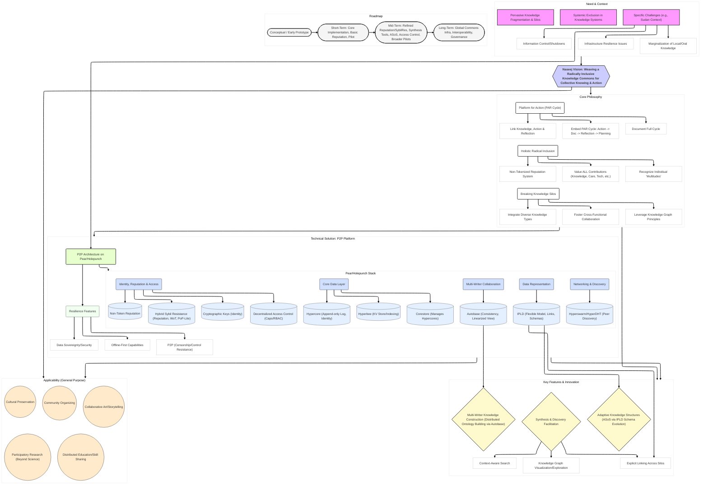

# Naseej: Weaving a Radically Inclusive Knowledge Commons for Action

Version: 1.1



## 1\. Introduction: Beyond Silos, Towards Collective Knowing and Doing

The contemporary world faces complex, interconnected challenges that demand collective understanding and coordinated action. However, our ability to respond effectively is often hampered by the pervasive fragmentation of knowledge. Information becomes trapped within disciplinary boundaries, professional jargon, organizational structures, and disparate community initiatives, hindering synthesis and preventing holistic problem-solving.1 Existing centralized platforms, while offering connectivity, frequently replicate and reinforce these silos, often prioritizing engagement metrics or proprietary control over genuine knowledge sharing and integration.3 Furthermore, these platforms often perpetuate exclusionary practices, valuing certain forms of knowledge and contribution while marginalizing others.1

Naseej (Arabic for "weaving" or "interlacing") emerges from this context not merely as a software tool, but as a socio-technical platform fundamentally designed to counteract fragmentation and foster collective intelligence. It is envisioned as a digital commons where communities can collaboratively build, share, validate, and act upon knowledge in a manner that is resilient, inclusive, context-aware, and action-oriented. Naseej seeks to weave together diverse threads of knowing and doing into a coherent, actionable tapestry.

This endeavor is guided by a set of core philosophical pillars that inform every aspect of its design and implementation:

*   **Holistic Radical Inclusion:** Moving beyond simple access, Naseej actively values the full spectrum of contributions—knowledge work, care work, technical support, cultural archiving, logistical coordination, artistic expression—necessary for collective action. It recognizes the inherent "multitudes" within each individual, acknowledging their diverse skills, experiences, and ways of knowing.5
    
*   **Breaking Knowledge Silos:** The platform is explicitly designed to facilitate connections and synthesis across disparate knowledge domains, enabling a more integrated understanding of complex issues.8
    
*   **A Platform for Action (PAR):** Naseej is structured around the Participatory Action Research (PAR) cycle, serving as an engine for communities to document actions, reflect on practice, and allow practice to refine theory in a continuous loop.11
    
*   **Contextual Grounding:** While globally applicable, Naseej's initial design is deeply informed by the specific challenges and needs observed within the Sudanese context, particularly concerning information access, infrastructure resilience, and the preservation of local knowledge.16
    

To realize these philosophical commitments, Naseej leverages a foundation of decentralized, peer-to-peer (P2P) technologies, specifically the Pear/Holepunch ecosystem.24 This stack, including technologies like Hypercore, Autobase, and Hyperswarm, provides the necessary resilience, user control, data sovereignty, and offline capabilities crucial for the platform's vision.25 InterPlanetary Linked Data (IPLD) serves as the underlying data model, offering the flexibility required to represent and interconnect diverse forms of knowledge.34

Naseej's vision extends significantly beyond the domain of Decentralized Science (DeSci) 1, although it aligns with DeSci's goals of openness and decentralization. It is conceived as a general-purpose infrastructure applicable to any domain requiring collaborative knowledge building and action, including community organizing, cultural heritage preservation, mutual aid coordination, historical archiving, participatory research, and artistic collaboration.

This whitepaper elaborates on the critical need for a platform like Naseej, delves into its guiding philosophy, outlines its proposed solution and P2P architecture, discusses its innovative aspects, and presents a roadmap for its development. It aims to demonstrate how Naseej offers a unique and necessary approach to fostering collective intelligence and action in an increasingly fragmented and complex world. The fundamental difference lies in its nature as a philosophically driven system, where technology serves the higher goals of inclusion, resilience, and actionable synthesis, rather than being an end in itself.

## 2\. The Need for Naseej: Fragmentation, Exclusion, and the Sudanese Context

The imperative for Naseej stems from observing critical, intertwined failures in contemporary knowledge systems: the pervasive fragmentation of information into silos, the systemic exclusion of diverse forms of knowledge and contribution, and the specific, acute challenges faced in contexts like Sudan, where information access itself is contested terrain.

*   **The Pervasiveness of Silos:** Knowledge, in its current institutional and digital forms, is often deeply siloed. Academic disciplines develop specialized languages and methodologies that impede cross-pollination. Professional fields create boundaries based on credentials and proprietary information. Community initiatives, even those working on related issues, may lack effective mechanisms for sharing learnings and coordinating efforts. This fragmentation leads to duplicated work, a failure to synthesize insights from different perspectives, and an inability to address complex, multi-faceted problems that transcend traditional boundaries.1 The rise of Decentralized Science (DeSci) aims to combat some of these issues by promoting open access and data sharing.1 However, even DeSci initiatives risk creating new silos if they focus too narrowly on specific types of scientific output or rely on incentive structures that don't capture the full spectrum of knowledge work.3
    
*   **Exclusion in Knowledge Systems:** Compounding the problem of fragmentation is the inherent exclusivity of many knowledge systems. Traditional academic and professional structures often privilege knowledge produced by credentialed experts, published in specific formats (e.g., peer-reviewed papers), and expressed in dominant languages. This systematically marginalizes other vital forms of knowing and doing: the deep ecological understanding embedded in indigenous knowledge systems 23, the practical wisdom gained through lived experience, the crucial relational and care work that sustains communities 6, artistic modes of inquiry and expression, and the rich tapestry of oral traditions.23 Centralized digital platforms often exacerbate this exclusion, their algorithms and interfaces prioritizing engagement or monetization over the equitable representation of diverse knowledge.6 This exclusion not only represents a loss of valuable insight but also reinforces existing power imbalances.5
    
*   **The Sudanese Context: Specific Challenges:** The general problems of fragmentation and exclusion manifest with particular urgency in contexts like contemporary Sudan. The ongoing conflict has created a situation where access to information is not only difficult but actively weaponized:
    

  *   **Information Fragmentation & Control:** Sudan has a history of internet shutdowns being used as a tool of control by state and non-state actors, particularly during periods of conflict and protest.17 These shutdowns, often targeting specific regions or service providers, create information blackouts designed to obscure atrocities, control narratives, and hinder coordination among civilians and aid organizations.17 The fragmentation of control between warring factions further complicates information access, with different groups potentially controlling infrastructure or restricting service restoration in specific areas.17 This manipulation of the digital sphere severely impacts communication, access to essential services (including mobile money transfers crucial for survival), the delivery of humanitarian aid, and efforts towards accountability.17
    
  *   **Infrastructure Resilience:** The conflict has severely damaged ICT infrastructure, leading to unreliable connectivity even when shutdowns are not actively enforced.18 Power outages further limit access.18 This underscores the critical need for communication and knowledge-sharing infrastructure that is inherently resilient, decentralized, resistant to censorship 3, and capable of functioning even with intermittent or localized connectivity (offline-first). The current reliance on expensive satellite services like Starlink highlights the gap in accessible, resilient infrastructure.18
    
  *   **Valuing Local & Indigenous Knowledge:** Sudan possesses immense cultural and linguistic diversity, with numerous ethnic groups and indigenous languages preserving unique traditions, knowledge systems, and oral histories.53 This local knowledge – encompassing agricultural practices, traditional medicine, social structures, conflict resolution mechanisms, and cultural heritage – is invaluable, particularly for navigating crises and building sustainable futures. However, this knowledge is often marginalized in formal systems and is highly vulnerable to disruption and loss during conflict and displacement.22 Platforms are needed that can respectfully document, preserve, share, and integrate this knowledge alongside other forms of information.
    

*   **Limitations of Existing Solutions:** Current technological solutions fall short of addressing this complex nexus of challenges. Centralized platforms are inherently vulnerable to the control and censorship witnessed in Sudan.17 Traditional databases lack the flexibility to handle diverse, evolving knowledge types and the resilience needed in unstable environments. While DeSci platforms offer decentralization, their frequent focus on tokenized incentives 2 may not be appropriate or effective for valuing the diverse contributions needed in community knowledge building, and they may not prioritize the specific resilience and offline features required in contexts like Sudan.
    

The specific, urgent needs of the Sudanese context—for resilient, censorship-resistant communication, offline access, and the integration of diverse and local knowledge—serve not merely as a use case for Naseej, but as a fundamental driver of its core philosophy and technical architecture. The platform's emphasis on P2P infrastructure, offline-first capabilities, and Holistic Radical Inclusion is a direct response to these grounded realities. By starting with these needs, Naseej aims to build a more relevant and impactful solution than technologies designed in isolation from such contexts.

## 3\. The Naseej Philosophy: Weaving a Radically Inclusive Knowledge Commons

Naseej is more than a technological system; it is an embodiment of a specific philosophy aimed at transforming how communities create, share, and utilize knowledge for collective action. This philosophy rests on three interconnected pillars: Holistic Radical Inclusion, Breaking Knowledge Silos, and serving as a Platform for Action through Participatory Action Research (PAR).

### 3.1. Holistic Radical Inclusion: Valuing the Multitudes

At the heart of Naseej lies the principle of Holistic Radical Inclusion. This concept extends beyond merely providing access; it signifies a fundamental commitment to recognizing, valuing, and integrating all forms of contribution essential for the flourishing of a knowledge commons and the effectiveness of collective action.5 Traditional systems often create hierarchies of knowledge and contribution, privileging formal expertise or easily quantifiable outputs.1 Naseej actively works against this by explicitly acknowledging the value of a diverse spectrum of work:

*   **Knowledge Work:** Research, analysis, data collection, synthesis, writing, documentation.
    
*   **Care Work & Relational Labor:** Community building, moderation, conflict resolution, providing emotional support, fostering trust, maintaining relationships, onboarding newcomers – the often invisible labor that makes collaboration possible and sustainable.6
    
*   **Technical Support:** Software development, infrastructure maintenance, user support, tool building.
    
*   **Cultural Archiving & Preservation:** Documenting oral histories, translating languages, preserving traditional practices, curating cultural artifacts.23
    
*   **Logistical Coordination:** Organizing events, managing resources, facilitating communication flows.
    
*   **Artistic Expression & Storytelling:** Creating visual art, music, poetry, or narratives that explore issues, communicate insights, or build community identity.11
    
*   **Experiential Knowledge:** Sharing insights derived from lived experience, practical skills, and local context.
    

This commitment is rooted in the concept of "Multitudes" – the recognition that each individual is not a monolithic entity defined by a single role or credential, but rather a complex intersection of diverse skills, experiences, perspectives, and ways of knowing. Naseej aims to create a space where these individual multitudes can be expressed and contribute holistically, valuing lived experience alongside formal training, and practical skills alongside theoretical knowledge.

Crucially, Holistic Radical Inclusion necessitates moving beyond purely financial or token-based incentive structures, which often dominate decentralized platforms and DeSci projects.2 While such systems can incentivize specific actions, they risk financializing all interactions, potentially creating plutocratic governance structures where influence is tied to wealth 63, and failing to recognize contributions not easily measured or tokenized. Naseej, therefore, proposes a non-tokenized recognition system. This system aims to build reputation based on demonstrated contributions across the diverse domains listed above.64 Reputation within Naseej is envisioned as non-transferable, earned through meaningful participation and peer validation, focusing on intrinsic motivation, community trust, and social recognition rather than speculative value. This approach directly counters the extractive tendencies often seen in platform capitalism, where user contributions (including relational and care labor) are harvested for platform profit without adequate recognition or compensation.7 It seeks to foster a regenerative ecosystem where the full spectrum of human effort required for collective action is seen and valued.

* * *

#### Table 1: Comparison of Contribution Valuation Models

  

| Model | Valued Contributions | Mechanisms | Potential Biases/Exclusions | Alignment with Inclusion |
| --- | --- | --- | --- | --- |
| **Naseej Non-Token Reputation** | Knowledge, Care/Relational, Technical, Cultural, Logistical, Artistic, Experiential | Peer validation, Contribution tracking (diverse types), Non-transferable scores/badges | Potential for subjectivity in peer validation; requires careful design to capture diverse contributions accurately. | High: Explicitly designed to value diverse, non-monetary contributions. |
| **Token-Based Voting/Staking (DeSci/DAO examples)** 40 | Financial investment (staking), Specific quantifiable actions (e.g., code commits, specific data uploads), Voting participation | Token rewards, Governance rights proportional to token holdings | Plutocratic (wealth = influence), Excludes non-financial contributions, Can incentivize speculation over genuine contribution, Sybil attack vulnerabilities. | Low to Medium: Primarily values financial or easily quantifiable contributions; inclusion depends heavily on token distribution fairness. |
| **Traditional Academic Metrics** | Peer-reviewed publications, Citations, Grant funding, Credentials | Journal impact factors, h-index, University rankings, Peer review | Disciplinary silos, Bias against interdisciplinary/applied work, Slow recognition cycles, Excludes non-textual/non-formal knowledge, Geographic/language bias. | Low: Highly formalized, excludes many knowledge forms and contributors. |
| **Platform Capitalism Metrics** 7 | Content generation, User engagement (clicks, likes, shares), Data provision (often implicit) | Algorithmic ranking, Advertising revenue models, Network effects | Prioritizes engagement/virality over quality/accuracy, Extracts value from unpaid user labor (data, relational), Lacks transparency, Centralized control. | Very Low: Primarily values contributions that generate platform revenue/engagement, often exploitative. |

* * *

### 3.2. Breaking Knowledge Silos: Fostering Synthesis and Integration

The second pillar of the Naseej philosophy is the commitment to actively Break Knowledge Silos. Recognizing that fragmentation hinders understanding and effective action 1, Naseej is designed not just to store different types of information, but to foster connections, dialogue, and synthesis between them. The goal is to create an environment where insights from diverse domains – scientific research, indigenous practices, artistic explorations, community experiences, logistical knowledge – can interact, challenge, and enrich one another.

This requires, firstly, the ability to integrate diverse knowledge types. Naseej envisions a flexible data model capable of representing and interlinking various forms of knowledge beyond traditional text and structured data. This could include multimedia content, recordings of oral histories 23, geospatial information, documentation of processes and actions, datasets, code, artistic works, and personal reflections. The underlying technical architecture must support this heterogeneity.35

Secondly, it involves fostering cross-functional collaboration. The platform aims to be a space where individuals with different backgrounds, expertise, and perspectives can converge around shared problems or areas of interest. Unlike discipline-specific forums or siloed communication channels, Naseej encourages interaction and contribution across these boundaries, creating opportunities for mutual learning and the emergence of novel, synthesized insights. This requires not only technical affordances but also community norms that value interdisciplinary respect and diverse epistemologies.

The structure of Naseej may draw inspiration from knowledge graph principles.8 By representing information as entities (e.g., concepts, projects, people, places, actions, reflections) and defining the relationships between them, the platform can facilitate the discovery of connections that might otherwise remain hidden. This structured, linked approach is key to navigating complexity and enabling synthesis.

Ultimately, breaking silos is not merely about co-locating diverse data; it is about creating the socio-technical conditions for meaningful integration and synthesis. This involves technological features that support linking and flexible data representation, coupled with a platform culture, fostered by the principles of Holistic Radical Inclusion, that actively encourages and values the weaving together of different threads of knowledge.

### 3.3. A Platform for Action (PAR): The Cycle of Knowing and Doing

The third pillar positions Naseej as a Platform for Action, driven by the methodology of Participatory Action Research (PAR).11 PAR is an approach where research is conducted with and by a community, rather than on them, with the explicit goal of generating knowledge to inform action and drive positive social change.15 Naseej adopts the PAR cycle as its core operational engine, structuring the platform to support the iterative process of:

1.  **Action:** Implementing interventions, undertaking projects, engaging in practices within the community.
    
2.  **Observation/Documentation:** Systematically documenting these actions and their immediate context or outcomes.
    
3.  **Reflection:** Critically analyzing the observations and experiences related to the action, identifying learnings, challenges, and successes.15
    
4.  **Planning/Re-planning (Meta-Reflection):** Using the reflections to refine understanding, adjust strategies, formulate new theories, and plan subsequent actions.15
    

Naseej is explicitly designed to document this entire cycle. Unlike platforms focused solely on storing static knowledge artifacts (like papers or datasets), Naseej provides tools and structures for communities to record:

*   **Actions Taken:** What was done, by whom, when, where, and why? This could involve linking to project plans, documenting specific interventions, or recording meeting outcomes.
    
*   **Reflections:** Structured or unstructured reflections on the actions, capturing individual and collective learnings, challenges encountered, unexpected outcomes, and emotional responses. Naseej aims to provide features that facilitate this reflection process, perhaps through prompts, templates, or collaborative annotation tools.15
    
*   **Meta-Reflections:** Spaces for reflecting on the reflection process itself, discussing the effectiveness of strategies, questioning underlying assumptions, and proposing changes to the community's theoretical frameworks or action plans.
    

A key aspect is the explicit linking of knowledge, action, and reflection. Naseej aims to make the connections between these elements visible and traceable.84 For example, a reflection entry could directly link to the specific action it discusses, which in turn might link to relevant data or knowledge artifacts that informed it. This creates a rich, contextualized history of the community's learning journey.

By embedding the PAR cycle, Naseej transforms from a passive repository into an active, dynamic learning system for communities. It provides the infrastructure needed to bridge the gap between knowing and doing, allowing practice to continuously inform theory and collective understanding to guide more effective action. This requires specific attention to user interface and user experience (UI/UX) design to make documenting actions and reflections intuitive and meaningful 100, as well as a flexible data model to capture these interconnected elements.

## 4\. Naseej: A Resilient P2P Platform for Collective Knowing and Doing

### 4.1. Solution Overview: Embodying the Philosophy

Naseej manifests the philosophical principles of Holistic Radical Inclusion, Breaking Knowledge Silos, and the Platform for Action (PAR) cycle through a concrete technological solution. It is a decentralized, peer-to-peer (P2P) platform designed to function as a resilient, inclusive, and action-oriented digital commons. Built upon the Pear/Holepunch technology stack 24, Naseej provides the infrastructure for communities to collaboratively manage knowledge and coordinate action, prioritizing user control, data sovereignty, and operational resilience.

### 4.2. Addressing the Sudanese Context: Resilience by Design

The design choices underpinning Naseej are directly informed by the acute challenges faced in contexts such as Sudan, ensuring the platform is not only functional but also robust and relevant in demanding environments.

*   **P2P Architecture for Resilience:** The fundamental choice of a P2P architecture, leveraging the Pear/Holepunch stack 24, is a direct response to the need for resilience against centralized control and censorship.17 Unlike centralized platforms vulnerable to single points of failure or shutdowns mandated by authorities, a P2P system distributes data and control across its participants, making it inherently harder to disrupt or censor.3
    
*   **Offline-First Capabilities for Intermittent Connectivity:** Recognizing Sudan's challenges with internet infrastructure damage and deliberate shutdowns 17, Naseej is designed with offline-first capabilities.25 Users can access data stored locally, create new contributions (knowledge entries, actions, reflections), and interact with their local instance of the commons even without an active internet connection. Data can then be synchronized with peers when connectivity is restored, using the underlying P2P protocols. This ensures continued productivity and access to information despite unreliable network conditions.
    
*   **Data Sovereignty and Security:** In environments where surveillance or data seizure is a risk, P2P architectures grant users greater control over their data.25 Naseej utilizes the security features of the Pear stack, including end-to-end encryption for communication between peers (e.g., via SecretStream 24) and cryptographic key pairs for identity and data signing.28 This helps protect the integrity and confidentiality of information within the commons.
    
*   **Valuing and Integrating Diverse Knowledge:** The platform's flexible data model (detailed in Section 5.4) is designed to accommodate and interlink diverse forms of knowledge. This directly addresses the need in Sudan (and globally) to preserve, share, and integrate valuable local and indigenous knowledge, including oral histories 22, alongside more formal data types. Naseej provides a space where these different ways of knowing can coexist and inform each other.
    

* * *

#### Table 2: Naseej Features Addressing Sudanese Context Challenges

  

| Sudanese Challenge | Relevant Naseej Feature | How it Addresses the Challenge |
| --- | --- | --- |
| **Internet Shutdowns & Centralized Control** 17 | P2P Architecture (Pear/Holepunch) 24, Decentralized Discovery (HyperDHT) 24 | Eliminates reliance on central servers, making it harder for authorities to shut down the entire system. Peer discovery via DHT avoids centralized bottlenecks for finding other users. |
| **Infrastructure Damage & Intermittent Connectivity** 18 | Offline-First Capabilities 114, P2P Replication (Hypercore) 129 | Allows users to access local data and create content offline. Data syncs opportunistically when peers connect, ensuring eventual consistency despite unstable networks. Replication provides data redundancy. |
| **Information Fragmentation & Lack of Synthesis** 16 | Flexible Data Model (IPLD) 35, Knowledge Linking 84, Silo-Breaking Philosophy | Enables integration of diverse data types (reports, local accounts, aid info, etc.) into one commons. Explicit linking helps reveal connections. Fosters cross-domain understanding needed for complex humanitarian/political situations. |
| Censorship & Narrative Control 17 | P2P Architecture, Data Sovereignty 25, Cryptographic Signing (Hypercore) 129 | Decentralized nature makes widespread censorship difficult. Users control their data. Cryptographic signatures ensure data integrity and verifiable attribution, countering disinformation by verifying the source of contributions. |
| **Marginalization of Local/Indigenous/Oral Knowledge** 22 | Flexible Data Model (IPLD), Holistic Radical Inclusion Philosophy 5 | Designed to accommodate non-textual data like audio/video for oral histories. Philosophical commitment to valuing diverse knowledge forms encourages the inclusion and preservation of local expertise and cultural heritage alongside formal data. |
| **Security & Privacy Concerns in Conflict Zones** 18 | End-to-End Encryption (SecretStream) 24, Cryptographic Identity 129 | Secure communication channels protect data in transit. Key-based identity provides authentication without necessarily revealing real-world identities unless desired. User control over data minimizes risks associated with centralized data breaches. |
| **High Cost of Alternative Access (e.g., Starlink)** 18 | P2P Architecture, Potential for Local Peering | Reduces reliance on costly centralized or satellite infrastructure by enabling direct peer connections. Facilitates data sharing over local networks where available, minimizing external bandwidth costs. |

* * *

### 4.3. Beyond DeSci: A General-Purpose Knowledge Commons

While Naseej incorporates principles like openness and decentralization that resonate with the Decentralized Science (DeSci) movement 1, its scope and applicability extend far beyond the confines of scientific research. Naseej is envisioned as a foundational, general-purpose infrastructure for any collaborative endeavor that involves building, sharing, and acting upon knowledge. Its core philosophical tenets and technical design address challenges common across numerous domains:

*   **Community Organizing:** Local groups can use Naseej to document community issues (e.g., housing, environment, public services), collaboratively develop action plans, share resources and best practices, coordinate mutual aid efforts, and track the progress and impact of their initiatives through the PAR cycle. The resilience and offline features are particularly valuable for grassroots organizing in potentially resource-constrained or politically sensitive environments.
    
*   **Cultural Preservation:** Communities can utilize Naseej to create a living, dynamic archive of their cultural heritage. This could involve documenting languages, recording oral histories and traditions 23, mapping significant sites, sharing traditional knowledge (e.g., ecological, medicinal), and collaboratively curating digital representations of artifacts. The P2P nature ensures community ownership and control over their heritage data.
    
*   **Participatory Research (Beyond Science):** Naseej provides an ideal platform for PAR projects across diverse fields such as public health, education, urban planning, and environmental justice.11 Researchers and community members can co-design studies, collaboratively collect qualitative and quantitative data, document actions taken based on findings, and engage in shared reflection and analysis, all within the platform.
    
*   **Collaborative Art and Storytelling:** Groups of artists, writers, or performers can use Naseej as a shared space to co-create works, share drafts and feedback, document their creative process (including actions and reflections), and build interconnected narratives or multimedia projects.
    
*   **Distributed Education and Skill Sharing:** Communities of practice or informal learning groups can build shared knowledge bases, develop learning resources collaboratively, document learning journeys (actions, projects, reflections), and facilitate peer-to-peer skill exchange and mentorship.
    

A key strength of Naseej in these diverse contexts is its capacity to integrate vastly different types of knowledge within a single, interconnected commons. A community project addressing local health disparities, for instance, could link formal epidemiological data (scientific knowledge) with patient testimonies (experiential knowledge), records of community health worker interventions (action documentation), reflections on program effectiveness (reflective knowledge), maps of local resources (geospatial knowledge), and relevant policy documents (legal knowledge). This ability to weave together multiple forms of knowing and doing is fundamental to breaking down silos and enabling holistic understanding and action.

Therefore, Naseej's potential impact is best understood not merely as a contribution to DeSci, but as a versatile infrastructure for fostering resilient, inclusive, and action-oriented knowledge ecosystems across any domain where collaboration and shared understanding are paramount. Its design addresses fundamental needs that transcend specific fields, particularly in contexts demanding decentralization, resilience, and the valuing of diverse contributions.

## 5\. Architecture: Building on Peer-to-Peer Foundations (Pear/Holepunch)

Naseej's architecture is deliberately built upon the Pear/Holepunch P2P ecosystem.24 This choice is foundational, providing a suite of interoperable modules designed specifically for building secure, resilient, local-first P2P applications.24 This stack enables Naseej to embody its core philosophical principles through concrete technical capabilities.

### 5.1. The Pear/Holepunch Ecosystem

Pear Runtime provides the environment for developing and running P2P applications, offering tools for building desktop, terminal, and potentially mobile applications without reliance on central servers.25 The ecosystem includes core data structures (Hypercore, Hyperbee, Hyperdrive), networking components (Hyperswarm, HyperDHT), and multi-writer capabilities (Autobase), all designed for decentralization, efficiency, and security.24

### 5.2. Core Data Layer: Hypercore, Corestore, Hyperbee

*   **Hypercore:** At the base lies Hypercore, a secure, distributed, append-only log.129 Each addition (append) to a Hypercore is cryptographically signed by the owner's private key and linked to previous entries via Merkle trees.129
    *   **Philosophical Alignment:** Hypercore's append-only nature provides an immutable, verifiable history of contributions, essential for the reflection and auditability aspects of the PAR cycle.140 Signatures ensure clear attribution, linking each contribution to a specific identity (public key).129 Its design supports sparse replication and efficient operation even in offline-first scenarios, crucial for resilience.139 Its potential for IPLD integration allows for flexible data representation.142
    

*   **Corestore:** Naseej utilizes Corestore to manage collections of potentially numerous Hypercores.120 A single Naseej instance might involve separate Hypercores for different data types (e.g., user profiles, specific knowledge domains, action logs, reflection journals, reputation ledgers) or different collaborative spaces.
    *   **Philosophical Alignment:** Corestore enables the modular organization needed to break down silos conceptually while maintaining underlying connections.143 Its namespacing feature allows multiple communities or projects to coexist within a shared Naseej instance without data collisions, supporting scalability and multi-tenancy.121 It simplifies the replication of these interconnected datasets.121
    

*   **Hyperbee:** Built atop Hypercore, Hyperbee provides an append-only B-tree structure, offering an efficient key-value store with support for sorted range queries.139
    *   **Philosophical Alignment:** Hyperbee is suitable for storing and indexing the structured data within Naseej, such as the definitions of knowledge artifacts (SKUs, including their types and relations/fields), contributor profiles, and potentially the non-tokenized reputation data.145 Its append-only nature preserves the history required for reflection and understanding evolution. Sub-databases (db.sub()) can further organize data, e.g., separating different types of SKUs or PAR cycle components 144, contributing to breaking down conceptual silos while maintaining linkage.
    

### 5.3. Multi-Writer Collaboration & Consistency: Autobase

Handling contributions from multiple participants concurrently in a decentralized system requires a robust mechanism for merging inputs and ensuring consistency. Naseej employs Autobase for this purpose.30

*   **Autobase Functionality:** Autobase acts as a "virtual Hypercore" layer, taking multiple input Hypercores (one per writer/contributor) and linearizing their appended blocks into a single, eventually consistent output view.30 It achieves this by analyzing the causal dependencies between blocks (forming a Directed Acyclic Graph - DAG).30 As new information arrives, Autobase can reorder blocks based on causality, ensuring that the final view reflects a consistent history.30 The apply function, provided by the application (Naseej), defines how the linearized sequence of events is processed to build or update the shared state (the view).30 Acknowledgements (ack) from designated "indexers" help confirm the linearized state and speed up convergence.30
    *   **Philosophical Alignment (PAR & Silo-Breaking):** Autobase directly enables the Platform for Action (PAR) cycle in a collaborative setting. Contributions from multiple users—documenting actions, adding knowledge artifacts, recording reflections—are appended to their individual Hypercores. Autobase then weaves these disparate threads into a coherent, shared timeline (the linearized view). The apply function acts as the engine that constructs the collective understanding or state based on these ordered contributions.30 This mechanism inherently breaks down silos by merging diverse inputs into a unified, evolving knowledge base.
    *   **Philosophical Alignment (Inclusion):** Autobase's multi-writer nature supports inclusive participation, allowing concurrent contributions without requiring strict, centralized locking mechanisms. Its eventual consistency model gracefully handles contributions from participants with varying levels of connectivity, supporting offline-first workflows essential for resilience.
    *   **Comparison with CRDTs:** Conflict-Free Replicated Data Types (CRDTs) are another approach to achieving eventual consistency in multi-writer scenarios.149 While CRDTs offer strong guarantees for specific data types (counters, sets, etc.), Autobase's DAG-based approach provides a built-in causal history that can be simpler to reason about for complex, evolving knowledge structures. Autobase's reordering mechanism handles conflicts based on the causal order of events 30, providing a deterministic way to merge concurrent contributions into the shared view.
    

### 5.4. Data Representation: IPLD (InterPlanetary Linked Data)

To represent the diverse and interconnected knowledge within Naseej, the platform utilizes the IPLD data model.34

*   **IPLD Data Model & Kinds:** IPLD provides a universal data model based on familiar kinds like maps, lists, strings, integers, booleans, bytes, and crucially, links.36 This allows different data structures to be represented in a compatible way, regardless of the underlying encoding format (like JSON or CBOR).

*   **Content Addressing & Linking (CIDs):** IPLD enables linking between data blocks using Content Identifiers (CIDs), which are derived from the cryptographic hash of the content itself.34 This creates content-addressed, verifiable links.
    *   **Philosophical Alignment (Silo-Breaking & Multitudes):** IPLD's inherent flexibility is key to Naseej's ability to break silos and support Holistic Radical Inclusion. It allows the platform to represent and interlink vastly different types of information – structured SKU definitions, unstructured reflections, action logs, contributor profiles, multimedia references, etc. – within a single, navigable data space.35 This supports the "multitudes" concept by allowing complex, multi-faceted contributions and knowledge types to coexist and be linked.
    *   **Philosophical Alignment (Resilience & Verifiability):** Content addressing ensures data integrity; any change to data results in a new CID, making tampering evident.36 This is vital for trust in a decentralized system, especially in contested information environments.


*   **IPLD Schemas:** Naseej leverages IPLD Schemas to define the structure of its data objects (e.g., SKUs, PAR entries).35 Schemas enable data validation, ensuring contributions conform to expected formats. They employ structural typing, meaning schemas can describe data based on its shape rather than embedded type names, allowing flexibility.35 Schemas also define representation strategies, allowing a balance between human-readable formats and more compact binary representations.35 Critically, IPLD Schemas support evolution, providing mechanisms to manage changes in data structures over time, which is essential for the Adaptive Schemas of Significance (ASoS) concept in Naseej.38
    
*   **Integration with Hypercore/Hyperbee:** IPLD data objects, typically encoded using efficient binary formats like DAG-CBOR 176, can be stored as the values within Hyperbee entries.179 The Autobase apply function would be responsible for decoding incoming IPLD data from peer contributions, validating it against the relevant IPLD schema, and updating the Hyperbee view accordingly.30
    

### 5.5. Networking & Discovery: Hyperswarm & HyperDHT

To enable peers to find each other and exchange data in a decentralized manner, Naseej utilizes Hyperswarm and HyperDHT.24

*   **Functionality:** Hyperswarm provides a high-level API for peers to join a "swarm" based on a shared topic (typically a Hypercore discovery key).132 It uses the underlying HyperDHT, a distributed hash table, to discover other peers interested in the same topic and facilitates establishing direct, end-to-end encrypted connections between them, employing UDP hole-punching techniques to navigate NATs and firewalls.132
    *   **Philosophical Alignment (Resilience & Decentralization):** This decentralized discovery mechanism eliminates reliance on central servers for peer finding, enhancing resilience and censorship resistance, crucial for the platform's operation in challenging environments like Sudan.24
    

### 5.6. Identity, Reputation, and Access Control

Managing participation, trust, and permissions in an open, decentralized system requires careful design, balancing inclusivity with security.

*   **Identity:** The foundation of identity in Naseej is the cryptographic key pair associated with each user's primary Hypercore.129 This public key serves as a stable, verifiable identifier within the system. User experience aspects related to key management might leverage concepts similar to Pear Keychain for ease of use.119
    
*   **Non-Token Reputation:** As outlined in the philosophy, Naseej employs a non-tokenized reputation system designed to reflect the value of diverse contributions.64 This system aims to track contributions across various categories (knowledge sharing, care work, technical help, etc.), potentially through peer attestations or analysis of activity within the platform, and translate these into non-transferable reputation scores or badges. This aligns with Holistic Radical Inclusion by recognizing a broader spectrum of value than purely financial or token-based systems.40 It focuses on building trust through demonstrated behavior and community recognition.65
    
*   **Sybil Resistance:** Preventing malicious actors from creating numerous fake identities (Sybil attacks) 190 to gain undue influence is critical. Naseej adopts a hybrid approach:
    *   **Reputation/Cost:** The non-token reputation system itself acts as a deterrent. Building genuine reputation across diverse contribution types is difficult and time-consuming to fake, making large-scale Sybil attacks costly in terms of effort, even if not direct monetary cost.66 Low-reputation identities would have limited influence.
    *   **Social Graphs/Web of Trust (WoT):** The system may incorporate elements of social network analysis or WoT principles.76 Trust relationships between existing, verified members could be used to vouch for new participants, leveraging the assumption that Sybil attackers have limited ability to form genuine trust links with the honest community.199 Implementation requires careful consideration of privacy implications 195 and the validity of assumptions about social graph structure.199
    *   **Proof of Personhood (PoP) LITE:** Given the context and the goal of inclusion, heavy-handed PoP mechanisms requiring extensive biometric data 213 or centralized identity verification 190 are likely unsuitable. Naseej may explore lightweight, community-centric PoP approaches, such as vouching within the WoT, or context-specific verification methods that are less burdensome.63 This acknowledges the "Decentralized Identity Trilemma" 63 – the difficulty of simultaneously achieving strong Sybil resistance, permissionlessness, and freeness/privacy. Naseej prioritizes inclusion and permissionlessness, accepting that Sybil resistance might rely more on social and reputational costs than absolute cryptographic barriers, and avoiding token-based resource tests.190
    *   **Philosophical Alignment:** This hybrid, non-token-centric approach to Sybil resistance is crucial for maintaining Radical Inclusion. It aims to make attacks difficult and costly in terms of social capital and effort, without imposing prohibitive financial or privacy-invasive barriers on legitimate participants from diverse backgrounds.190
    
*   **Access Control:** Managing permissions within the decentralized commons is necessary. While Hypercore/Hyperdrive offer basic write control based on key ownership 141, more granular control is needed. Naseej might explore:
    *   **Capability-Based Systems:** Concepts like UCANs (User-Controlled Authorization Networks) offer a model for delegable, fine-grained permissions.224 While direct integration with Hypercore isn't documented 225, UCAN principles could inform an access control layer built on top, potentially linking capabilities to reputation levels.
    *   **Decentralized RBAC:** Role-Based Access Control patterns could be adapted.230 Roles (e.g., contributor, moderator, archivist) could be defined within communities, associated with specific permissions, and assigned based on reputation or community consensus, with role definitions and assignments managed within Hyperbee/Autobase.
    *   **Philosophical Alignment:** A flexible, community-configurable access control system supports inclusion (allowing different levels of participation) and security, enabling groups to protect sensitive information while maintaining an open commons.33
    

The deliberate selection of the Pear/Holepunch stack and technologies like IPLD, combined with a bespoke, non-tokenized reputation and hybrid Sybil resistance mechanism, demonstrates how Naseej's architecture is purpose-built to manifest its core philosophy. It prioritizes resilience, user agency, flexibility, and inclusivity, rejecting architectures that would compromise these values.

* * *

#### Table 3: Naseej Philosophical Principles vs. Technical Enablers

  

| Philosophical Principle | Key Technical Components | Justification / Linkage |
| --- | --- | --- |
| **Holistic Radical Inclusion** | Non-Token Reputation System 64, IPLD Data Model 35, P2P Architecture 24 | Values diverse contributions beyond finance/code. Flexible data model represents varied knowledge types ("multitudes"). P2P lowers barriers to entry compared to costly centralized infra. Hybrid Sybil resistance avoids exclusionary PoP/KYC. |
| **Breaking Knowledge Silos** | IPLD (Links & Schemas) 34, Autobase 30, Hyperbee (Sub-DBs) 144 | IPLD links connect diverse data types across domains. Autobase merges inputs from different contributors/domains into a unified view. Hyperbee sub-databases organize related information. Facilitates synthesis and discovery across boundaries. |
| **Platform for Action (PAR Cycle)** | Autobase 30, Hypercore (Append-only Log) 129, IPLD Linking 34 | Autobase linearizes actions, reflections, etc., from multiple writers into a shared history. Hypercore provides immutable record of the cycle. IPLD links explicitly connect actions, reflections, and knowledge artifacts, making the learning loop visible and traceable. |
| **Contextual Resilience (Sudan Focus)** | P2P Architecture (Pear/Holepunch) 24, Offline-First Capabilities 114, HyperDHT/Hyperswarm 132, E2E Encryption 24 | Decentralization resists shutdowns/censorship. Offline access ensures usability with intermittent connectivity. DHT enables peer discovery without central servers. Encryption protects data in potentially insecure environments. Directly addresses infrastructure and control challenges. |
| **User Control & Data Sovereignty** | P2P Architecture, Cryptographic Keys (Hypercore) 129, Local-First Design 24 | Data resides primarily on user devices, not central servers. Users control their own cryptographic keys for identity and signing. Local-first approach prioritizes user access and control over their local data copy. |

* * *

## 6\. Innovation: Adaptive Knowledge Structures and Synthesis

Naseej's innovation extends beyond its philosophical grounding and P2P architecture. It lies in the synergistic combination of its components to create a dynamic, collectively constructed knowledge system capable of adaptation and fostering deep synthesis. Key innovative aspects include its flexible data model supporting evolution, its use of multi-writer technology for collaborative knowledge building, and its design features aimed at facilitating synthesis and discovery.

### 6.1. Data Model Flexibility & Evolution (ASoS)

A static knowledge structure cannot adequately serve a living community engaged in ongoing action and reflection. Naseej addresses this through a flexible and evolvable data model, leveraging IPLD and aiming towards Adaptive Schemas of Significance (ASoS).

*   **IPLD Schema Flexibility:** As discussed, IPLD Schemas provide the necessary flexibility to represent the diverse entities within Naseej: SKUs (defining types, relations, fields), PAR cycle components (action records, reflection entries), contributor profiles, reputation data, and the crucial links connecting them.35 For instance, a ReflectionEntry schema might include fields for the reflective text, a link (&ActionEntry) to the action being reflected upon, links to contributors (\[&ContributorProfile\]), and associated tags or concepts (\`\`).35
    
*   **Adapting to Emergence (ASoS):** Naseej embraces the idea that the very structure of knowledge should adapt based on the community's evolving understanding and practice. The concept of Adaptive Schemas of Significance (ASoS) envisions the knowledge structure itself (represented by IPLD Schemas) as subject to change through community consensus. IPLD's features for schema evolution (e.g., using unions or dedicated version fields to distinguish schema versions, defining migration functions to translate between versions 38) provide the technical foundation. Changes to schemas could be proposed as specific event types within the Autobase log. Following community discussion and consensus (potentially mediated by the reputation system), these changes could be formally adopted, perhaps by updating the schema definitions used by the Autobase apply function or through a dedicated schema management layer built on Autobase. This contrasts sharply with the rigidity of traditional databases or knowledge bases where schema changes are often difficult and disruptive.140
    
*   **Philosophical Alignment:** This capacity for structural adaptation is a direct implementation of the PAR principle that practice should refine theory.12 As a community acts and reflects, its understanding (and thus the optimal way to structure its knowledge) evolves. ASoS allows the Naseej commons to be a living system, reflecting this ongoing learning journey rather than being constrained by a fixed initial design.
    

### 6.2. Multi-Writer Knowledge Construction

Autobase serves not just as a log synchronization mechanism but as the engine for the collaborative construction of the Naseej knowledge graph itself.30

*   **Distributed Ontology Building:** Users don't merely consume a predefined structure; they actively participate in building it. A user might propose a new SKU type, define a new relationship between existing types, or link a specific reflection to an action by appending a corresponding IPLD object (structured according to the relevant schema) to their personal Hypercore.
    
*   **The apply Function as Consensus Point:** These proposed changes flow into the Autobase linearization process. The critical point of integration is the apply function.30 This function, executed by peers (especially indexers), examines the linearized stream of proposed changes. It must contain the logic to validate these proposals (e.g., checking schema validity, ensuring consistency, potentially verifying contributor reputation or applying community-defined consensus rules) and decide whether to integrate the change into the shared view (e.g., updating the Hyperbee representing the knowledge structure).251 Managing updates to the apply function itself in a decentralized, trustworthy way presents a significant governance challenge, potentially requiring its own consensus mechanism.251
    

### 6.3. Facilitating Synthesis and Discovery

Beyond storing and structuring knowledge, Naseej aims to actively facilitate synthesis – the drawing of new connections and insights from the assembled information.

*   **Linking Across Silos:** The platform's design and UI/UX 100 will encourage and simplify the creation of meaningful links (using IPLD CIDs) between different elements. Users should be able to easily link a reflection to the specific action it pertains to, connect a research finding (SKU) to a community project (Action) that applied it, associate an oral history recording with a geographical location (Place SKU), or relate a technical solution to the problem it addressed. Making these relationships explicit is the first step towards synthesis.
    
*   **Knowledge Graph Visualization/Exploration:** To help users navigate the potentially vast and complex web of interconnected information, Naseej can incorporate knowledge graph visualization techniques.84 Interactive graph interfaces could allow users to explore connections, filter by entity type or relationship, identify clusters of activity or knowledge, and discover non-obvious pathways, thereby stimulating synthetic thinking.86
    
*   **Search and Discovery:** The combination of structured data storage (Hyperbee), defined schemas (IPLD Schemas), and explicit linking enables more powerful and context-aware search and discovery than is possible in repositories of unstructured documents. Users could search not just for keywords but for specific types of entities, relationships, or patterns within the PAR cycle.
    

The innovation of Naseej arises from the interplay of these elements. Autobase provides the decentralized, multi-writer foundation for collaborative construction. IPLD offers the flexible, linkable data language. The PAR philosophy provides the guiding framework, ensuring that the construction process is geared towards actionable, reflective learning. Together, they create the potential for a truly adaptive and synthetic knowledge commons, capable of evolving alongside the communities it serves.

## 7\. Roadmap and Future Directions

The development of Naseej is an ongoing process, guided by its core philosophical principles and the goal of creating a robust, general-purpose knowledge commons.

**Current Status:** Naseej is currently in the conceptual and early prototyping phase. Foundational architectural decisions have been made, centering on the Pear/Holepunch stack (Hypercore, Hyperbee, Autobase, Hyperswarm) and the IPLD data model. Initial schema designs for core entities (SKUs, PAR components, basic contributor profiles) are being developed.

### Phase 0: MVP Setup & Foundational Practices

Rapidly build the essential Anytype structure, onboard a small core team, validate basic functionality, and establish good data practices compatible with future verifiability goals.

* [x] **Core Structure Setup (High Priority):** Use existing solutions (e.g. AnyType)

* [ ] **Foundational Document Integration:** Add latest versions of core documents

* [ ] **Minimal Onboarding & Core Team:** Finalize simple onboarding checklist (reading core docs, Anytype invite, emphasis on data quality/linking/attribution).

* [ ] **Initial Content Seeding & Testing (MVP Validation):** Core team adds a small number of diverse SKU examples.

  * **Focus:** Basic Anytype functionality (Object creation, linking, Sets) AND Foundational Practice (Is source/contributor info captured consistently? Are initial links meaningful? Does the structure support basic provenance tracking?).

  * **Task:** Core team begins documenting any immediate limitations encountered with Anytype regarding collaboration, linking complexity, or data structure needs.

* [ ] **Basic Communication Channel:** Set up simplest viable channel for core team communication/feedback.

    
### Short-Term Goals (Next 6-12 Months):    

* [ ]   **Core Implementation:** Develop the basic platform functionalities: creating, storing, and linking core knowledge artifacts (SKUs) and PAR cycle elements (actions, reflections) using Hyperbee and Autobase. Implement basic IPLD schema validation within the apply function.
    
* [ ]   **Basic Reputation & Identity:** Implement the foundational cryptographic identity system based on Hypercore keys. Begin development of the non-tokenized reputation tracking mechanism, focusing initially on capturing contribution types.
    
* [ ]   **P2P Networking:** Ensure reliable peer discovery and data replication using Hyperswarm/HyperDHT.
    
* [ ]   **Usability Testing & Pilot:** Conduct early usability testing with a small, targeted community. Initiate a pilot project, potentially focusing on a specific use case like cultural archiving within a Sudanese diaspora community or supporting a collaborative research project aligned with PAR principles. Gather feedback on core functionality and user experience.
    

### Mid-Term Goals (1-3 Years):
    

* [ ]   **Refined Reputation System:** Fully develop and integrate the non-tokenized reputation system, including mechanisms for peer validation and diverse contribution tracking. Explore lightweight Sybil resistance mechanisms (WoT, PoP-lite).
    
* [ ]   **Enhanced Synthesis & Visualization:** Implement tools for knowledge graph visualization and exploration to aid discovery and synthesis.84 Develop more advanced search capabilities leveraging the structured data and links.
    
* [ ]   **ASoS Implementation:** Develop and test mechanisms for adaptive schema evolution (ASoS), allowing communities to propose and adopt changes to the knowledge structure based on consensus. Refine the governance process for updating the Autobase apply function.
    
* [ ]   **Access Control:** Implement a flexible, decentralized access control system (potentially drawing from UCAN or RBAC principles) integrated with the reputation system.
    
* [ ]   **Broadened Use Case Pilots:** Expand pilot projects into diverse domains identified (community organizing, education, etc.) to test and refine Naseej's general-purpose applicability.
    

### Long-Term Vision:
    

* [ ]   **Global Commons Infrastructure:** Establish Naseej as a robust, widely adopted, open-source infrastructure for diverse communities globally seeking resilient, inclusive, and action-oriented knowledge management.
    
* [ ]   **Interoperability:** Explore integrations with other decentralized tools, protocols (like DeSci platforms where appropriate), and data standards to foster a richer ecosystem.
    
* [ ]   **Community Governance:** Develop mature decentralized governance mechanisms for the Naseej protocol and codebase itself, ensuring its long-term sustainability and alignment with community needs.
    
* [ ]   **Continued Philosophical Alignment:** Ensure all future development remains deeply rooted in the core principles of Holistic Radical Inclusion, Breaking Silos, PAR, and Contextual Resilience.
    

The roadmap reflects the ambition of Naseej to move beyond a niche tool towards a foundational layer for collaborative intelligence. It prioritizes building the core P2P infrastructure, integrating the philosophical commitments into the reputation and governance systems, and then expanding capabilities for synthesis and adaptation based on real-world usage and feedback.

### Call to Action

Naseej is an open, collaborative endeavor. We invite researchers, developers, community organizers, cultural preservationists, activists, and potential users interested in building more resilient and inclusive knowledge systems to engage with the project. Contributions, feedback, and participation in pilot projects are welcomed.
    

## 8\. Conclusion: Weaving the Future of Knowledge

Naseej represents a deliberate effort to weave together philosophy, technology, and context to address fundamental challenges in how we collectively know and act. Faced with pervasive knowledge fragmentation, systemic exclusion, and the acute need for resilient infrastructure in contexts like Sudan, Naseej offers a distinct alternative to centralized, extractive digital platforms. Its core value proposition lies in its deep commitment to Holistic Radical Inclusion, valuing the diverse "multitudes" within individuals and the full spectrum of contributions needed for collective well-being; its design for Breaking Knowledge Silos through flexible data models and fostering synthesis; its operationalization of the Participatory Action Research (PAR) cycle as a Platform for Action; and its grounding in Contextual Resilience through a robust P2P, offline-first architecture built on the Pear/Holepunch stack and IPLD.

Key differentiators set Naseej apart. Its explicit philosophical foundation guides every technical choice, ensuring technology serves human values. Its rejection of purely token-based incentives in favor of a nuanced, non-transferable reputation system aims to foster genuine collaboration and avoid plutocracy. Its P2P, local-first architecture provides inherent resilience, censorship resistance, and user data sovereignty, critical for trust and operation in diverse global contexts. Its ambition extends beyond any single domain like DeSci, positioning it as a potential general-purpose infrastructure for a wide array of collaborative knowledge work.

The potential impact of Naseej is significant. By providing a shared, resilient, and inclusive digital commons, it can empower communities to better understand their contexts, coordinate actions more effectively, preserve vital cultural knowledge, conduct meaningful participatory research, and build collective intelligence from the ground up. It offers a pathway towards digital ecosystems that are not merely connective, but genuinely collaborative, adaptive, and equitable.

Building digital infrastructures that reflect and reinforce values of inclusion, agency, collective learning, and resilience is one of the critical tasks of our time. Naseej is proposed as a concrete, technically grounded, and philosophically coherent step in this direction – an attempt to begin weaving a different kind of digital fabric, one capable of supporting more just and effective ways of knowing and acting together in our complex world.

## How to Cite

```
@misc{naseej_whitepaper_[Year],
  author       = {{Naseej Collective}},
  title        = {Naseej Whitepaper},
  year         = {[Year]},
  howpublished = {\url{https://github.com/Naseej-Collective/Naseej-Whitepaper}},
  version      = {{1.1}}
}
```
# Works cited

1.  [What is Decentralized Science (DeSci)? | Onchain Magazine](https://onchain.org/magazine/what-is-decentralized-science-desci/)
2.  [Decentralized Science (DeSci): A Paradigm Shift in Scientific Exploration - TokenMinds](https://tokenminds.co/blog/knowledge-base/decentralized-science)
3.  [Top Decentralized Science (DeSci) Projects for 2024/2025 | TokenInsight](https://tokeninsight.com/en/tokenwiki/all/top-decentralized-science-desci-projects-for-2024-2025)
4.  [What Is Decentralized Science (DeSci)? Everything You Need to Know - BNB Chain Blog](https://www.bnbchain.org/fr-FR/blog/what-is-decentralized-science-desci)
5.  [Radical Inclusion: Seven Steps to Help You Create a More Just Workplace, Home, and World: Sengeh, David Moinina - Amazon.com](https://www.amazon.com/Radical-Inclusion-Seven-Create-Workplace/dp/1250827744)
6.  [Is Data Labor? Two Conceptions of Work and the User-Platform ...](https://www.cambridge.org/core/journals/business-ethics-quarterly/article/is-data-labor-two-conceptions-of-work-and-the-userplatform-relationship/15E922A1132C86474545D35F7F58426D)
7.  [A social reproduction analysis of digital care platform work - Taylor ...](https://www.tandfonline.com/doi/pdf/10.1080/13563467.2024.2317703)
8.  [Step-by-Step Guide to Building a Knowledge Graph in 2025 - PageOn.ai](https://www.pageon.ai/blog/knowledge-graph)
9.  [Relational Databases vs. Graph Databases: What's the Difference?](https://www.schemaapp.com/schema-markup/relational-databases-vs-graph-databases/)
10. [Knowledge graphs | The Alan Turing Institute](https://www.turing.ac.uk/research/interest-groups/knowledge-graphs)
11. [Youth Participatory Action Research | Learner Variability Project](https://lvp.digitalpromiseglobal.org/content-area/portrait-of-a-learner-9-12/strategies/youth-participatory-action-research-portrait-of-a-learner-9-12/summary)
12. [Understanding Participatory Action Research Example - Best Dissertation Writers](https://bestdissertationwriter.com/participatory-action-research-example/)
13. [Example 5: Youth Participatory Action Research for the 8th Grade Civics (civics)](https://yppactionframe.fas.harvard.edu/example-5-youth-participatory-action-research)
14. [Participatory Action Research Model in 2024 - Insight7 - AI Tool For ...](https://insight7.io/participatory-action-research-model-in-2024/)
15. [Full article: The 7 C's framework for participatory action research: inducting novice participant-researchers](https://www.tandfonline.com/doi/full/10.1080/09650792.2023.2234417)
16. [Split decision: Why Sudan is on the brink of partition—again | ECFR](https://ecfr.eu/publication/split-decision-why-sudan-is-on-the-brink-of-partition-again/)
17. [Internet in Conflict: Sudan's Battle for Connection - The Tahrir Institute for Middle East Policy](https://timep.org/2024/09/19/internet-in-conflict-sudans-battle-for-connection/)
18. [Sudan: Freedom on the Net 2024 Country Report](https://freedomhouse.org/country/sudan/freedom-net/2024)
19. [Sudan conflict: internet shutdowns deepening a humanitarian crisis - Access Now](https://www.accessnow.org/the-sudan-conflict-how-internet-shutdowns-deepen-a-humanitarian-crisis/)
20. [\#KeepItOn in times of war: Sudan's communications shutdown must be reversed urgently - Access Now](https://www.accessnow.org/press-release/keepiton-sudan-shutdown/)
21. [Sudan: Internet shutdown threatens delivery of humanitarian and emergency services](https://www.amnesty.org/en/latest/news/2024/03/sudan-internet-shutdown-threatens-delivery-of-humanitarian-and-emergency-services/)
22. [Oral History in Somalia and South Sudan - Rift Valley Institute](https://riftvalley.net/events/oral-history-somalia-and-south-sudan/)
23. [Oral Traditions | indigenousfoundations](https://indigenousfoundations.arts.ubc.ca/oral_traditions/)
24. [Pear by Holepunch | Pears.com](https://docs.pears.com/)
25. [Holepunch launches Pear Runtime, an open-source peer-to-peer app development platform](https://sdtimes.com/open-source/holepunch-launches-pear-runtime-an-open-source-peer-to-peer-app-development-platform/)
26. [Holepunch unveils groundbreaking open-source peer-to-peer app development platform: Pear Runtime](https://pears.com/news/holepunch-unveils-groundbreaking-open-source-peer-to-peer-app-development-platform-pear-runtime/)
27. [Tether CEO Paolo Ardoino teases potential Pear Phone powered by P2P apps - CryptoSlate](https://cryptoslate.com/tether-ceo-paolo-ardoino-teases-potential-pear-phone-powered-by-p2p-apps/)
28. [Tether, Holepunch, and Synonym Launch Pear Credit, a P2P Credit System](https://tether.io/news/tether-holepunch-and-synonym-launch-pear-credit-a-p2p-credit-system/)
29. [Holepunch Unveils P2P Platform "Pear Runtime" | Hacker News](https://news.ycombinator.com/item?id=39373960)
30. [Autobase | Pears.com - Pear by Holepunch - Pear Runtime](https://docs.pears.com/building-blocks/autobase)
31. [Holepunch](https://holepunch.to/)
32. [Holepunch - GitHub](https://github.com/holepunchto)
33. [dat-ecosystem](https://dat-ecosystem.org/)
34. [ipld/docs: All you need to know about IPLD - GitHub](https://github.com/ipld/docs)
35. [IPLD Schemas](https://ipld.io/docs/schemas/)
36. [IPLD The Brief Primer](https://ipld.io/docs/intro/primer/)
37. [IPLD Docs](https://ipld.io/docs/)
38. [IPLD Schemas: Introduction](https://ipld.io/docs/schemas/intro/)
39. [Concepts | IPFS Docs](https://docs.ipfs.tech/concepts/)
40. [TDeFi Blogs - Decentralized Science (DeSci): A Narrative hidden in shadows?](https://tde.fi/founder-resource/blogs/meme/decentralized-science-desci-a-narrative-hidden-in-shadows/)
41. [DeSci: Transforming Research with Decentralized Science - Bankless](https://www.bankless.com/the-essentials-of-desci)
42. [Inside DeSci: Sector Overview and 40+ Projects List - DWF Labs](https://www.dwf-labs.com/research/488-decentralised-science-desci-projects-overview)
43. [Breaking barriers: Decentralized science (DeSci) - Phantom](https://phantom.com/learn/crypto-101/decentralized-science-desci)
44. [Decentralized Science \[DeSci\], Crypto Concepts: Beginner's Guide - DIA oracles](https://www.diadata.org/crypto-narratives/decentralized-science-desci/)
45. [A curated list of awesome DeSci resources, projects, events, articles and more - GitHub](https://github.com/DeSciWorldDAO/awesome-desci)
46. [What is decentralized science (DeSci)? - The Block](https://www.theblock.co/learn/342505/what-is-decentralized-science-desci)
47. [Decentralized Science Development Company | DeSci Development Solutions](https://www.hivelance.com/desci-development-company)
48. [Decentralized Science (DeSci) - The Next Big Blockchain Development? - Phemex](https://phemex.com/academy/decentralized-science-desci-the-next-big-blockchain-development)
49. [What Is Decentralized Science (DeSci)? - OSL](https://osl.com/academy/article/what-is-decentralized-science-desci)
50. [How Decentralized Science (DeSci) Improves Research - Ulam Labs](https://www.ulam.io/blog/how-decentralized-science-is-revolutionizing-research)
51. [Top 5 Projects in Decentralized Science DeSci - DroomDroom](https://droomdroom.com/top-projects-in-decentralized-science-desci/)
52. [What Is Decentralized Science (DeSci)? - Hacken.io](https://hacken.io/discover/decentralized-science-desci/)
53. [Sudan'S Cultural Diversity: Exploring Ethnic Groups And Indigenous Languages](https://afrodiscovery.com/country/sudan/sudan-tribes-languages/sudans-cultural-diversity-exploring-ethnic-groups-and-indigenous-languages/)
54. [Oral traditions and expressions including language as a vehicle of ...](https://ich.unesco.org/en/oral-traditions-and-expressions-00053)
55. [Converting donation to transaction: how platform capitalism exploits ...](https://academic.oup.com/ser/article/21/4/1897/7058165)
56. [Using Oral History to Redress Moral Degeneration Amongst the Youth in Higher Education Institutions of South Africa | E-Journal of Religious and Theological Studies](https://www.ajol.info/index.php/erats/article/view/288458)
57. [The Power of Digital Inclusion - WCET - WICHE](https://wcet.wiche.edu/frontiers/2018/02/15/the-power-of-digital-inclusion/)
58. [Principles for Digital Development](https://digitalprinciples.org/)
59. [Principles for Digital Development - INEE](https://inee.org/resources/principles-digital-development)
60. [The Principles for Digital Development have been refreshed for the next decade. Here's how.](https://digitalprinciples.org/2024/03/29/the-principles-for-digital-development-have-been-refreshed-for-the-next-decade-heres-how/)
61. [Digital work platform: Understanding platforms, workers, clients in a ...](https://pmc.ncbi.nlm.nih.gov/articles/PMC9845709/)
62. [Platform labour in search of value - International Labour Organization](https://www.ilo.org/sites/default/files/wcmsp5/groups/public/@ed_emp/@emp_ent/@coop/documents/publication/wcms_809250.pdf)
63. [Who Watches the Watchmen? A Review of Subjective Approaches for Sybil-Resistance in Proof of Personhood Protocols - Frontiers](https://www.frontiersin.org/articles/10.3389/fbloc.2020.590171/full)
64. [The Paradox of Pseudonymity - Identity Management Institute®](https://identitymanagementinstitute.org/the-paradox-of-pseudonymity/)
65. [DAO Governance Models 2024: Ultimate Guide to Token vs. Reputation Systems](https://www.rapidinnovation.io/post/dao-governance-models-explained-token-based-vs-reputation-based-systems)
66. [Decentralized reputation - Cryptology ePrint Archive](https://eprint.iacr.org/2020/761.pdf)
67. [Reputation Systems for Anonymous Networks - CS@Columbia](https://www.cs.columbia.edu/~smb/papers/anonrep.pdf)
68. [Building Trust and Reputation Systems in Web3 - BlockApps Inc.](https://blockapps.net/blog/building-trust-and-reputation-systems-in-web3/)
69. [How Onchain Identity is Shaping Web3 Professional Reputations - Joba Network](https://www.joba.network/blog/how-onchain-identity-is-shaping-web3-professional-reputations)
70. [Exploring Decentralised Reputation and Its Use Cases - cheqd](https://cheqd.io/blog/exploring-decentralised-reputation-and-its-use-cases/)
71. [Reputation by Design: Using Web 3.0 to Build Trust Online](https://www.internetreputation.com/reputation-by-design-using-web-3-0-to-build-trust-online/)
72. [Types Of Reputation Systems - FasterCapital](https://fastercapital.com/topics/types-of-reputation-systems.html)
73. [Top Reputation System for Trust in Smart Contracts - Nadcab Labs](https://www.nadcab.com/blog/smart-contract-reputation-systems)
74. [A Novel Framework for Reputation-Based Systems - a16z crypto](https://a16zcrypto.com/posts/article/reputation-based-systems/)
75. [research/reputation/docs/initialization.md at master · witnet/research - GitHub](https://github.com/witnet/research/blob/master/reputation/docs/initialization.md)
76. [Survey on social reputation mechanisms: Someone told me I can trust you - ResearchGate](https://www.researchgate.net/publication/366246884_Survey_on_social_reputation_mechanisms_Someone_told_me_I_can_trust_you)
77. [(PDF) A Reputation-based Trust Management System for P2P Networks - ResearchGate](https://www.researchgate.net/publication/220284409_A_Reputation-based_Trust_Management_System_for_P2P_Networks)
78. [A peer to peer reputation system based on a rolling blockchain - temtum](https://temtum.com/static/478635b7b627918784a08b3459c40670/rep-on-the-roll-a-peer-to-peer-reputation-system-based-on-a-rolling-blockchain.pdf)
79. [\[2409.09329\] Reputation-Driven Peer-to-Peer Live Streaming Architecture for Preventing Free-Riding - arXiv](https://arxiv.org/abs/2409.09329)
80. [Design Considerations for Decentralized Reputation Systems - GitHub](https://github.com/WebOfTrustInfo/rwot4-paris/blob/master/final-documents/reputation-design.md)
81. [DAO Governance: Effectively Create And Manage Governance Tokens | Bitbond](https://www.bitbond.com/resources/dao-governance-effectively-create-and-manage-governance-tokens/)
82. [What is Reputation-Based Voting in DAOs - Colony Blog](https://blog.colony.io/what-is-reputation-based-governance/)
83. [Platform Cooperativism: Challenging the Corporate Sharing Economy - Rosa Luxemburg Stiftung](https://rosalux.nyc/wp-content/uploads/2020/11/RLS-NYC_platformcoop.pdf)
84. [Knowledge Graphs with LLMs: Optimizing Decision-Making - Addepto](https://addepto.com/blog/leveraging-knowledge-graphs-with-llms-a-business-guide-to-enhanced-decision-making/)
85. [How knowledge graphs form a system of truth underpinning agentic apps - Hypermode](https://hypermode.com/blog/how-knowledge-graphs-underpin-ai-agent-applications)
86. [Knowledge Graph Tools: The Ultimate Guide - PuppyGraph](https://www.puppygraph.com/blog/knowledge-graph-tools)
87. [How to Build a Knowledge Graph for Beginners\[+Step & Tips\] - PageOn.ai](https://www.pageon.ai/blog/how-to-build-a-knowledge-graph)
88. [What is a Knowledge Graph in SEO? | Schema App Solutions](https://www.schemaapp.com/schema-markup/what-is-a-content-knowledge-graph/)
89. [AGENTiGraph: An Interactive Knowledge Graph Platform for LLM-based Chatbots Utilizing Private Data - arXiv](https://arxiv.org/html/2410.11531v1)
90. [Knowledge graphs in machine learning: Significance, applications and development](https://www.leewayhertz.com/knowledge-graph-in-machine-learning/)
91. [Merging LLMs and Knowledge Graphs - Datavid](https://datavid.com/blog/merging-large-language-models-and-knowledge-graphs-integration)
92. [Knowledge graph visualization: A comprehensive guide \[with examples\] - Datavid](https://datavid.com/blog/knowledge-graph-visualization)
93. [Visualizing a Knowledge Graph? - Qlik Dork](https://qlikdork.com/2025/01/visualizing-a-knowledge-graph/)
94. [Knowledge graph embedding by reflection transformation - ResearchGate](https://www.researchgate.net/publication/356888173_Knowledge_graph_embedding_by_reflection_transformation)
95. [Knowledge Graphs in Practice: Characterizing their Users, Challenges, and Visualization Opportunities - arXiv](https://arxiv.org/html/2304.01311v4)
96. [Digital media innovations through participatory action research - DiVA portal](https://www.diva-portal.org/smash/get/diva2:1680681/FULLTEXT01.pdf)
97. [What is Participatory Action Research ? — Indeemo](https://indeemo.com/blog/what-is-participatory-action-research)
98. [A Guide to Documenting Action Research in Education - Teachers Institute](https://teachers.institute/learning-teaching/documenting-action-research-education/)
99. [Participatory Action Research: A Toolkit - University of Reading](https://research.reading.ac.uk/community-based-research/wp-content/uploads/sites/114/2023/06/PAR-Toolkit-v10.pdf)
100. [Participatory Action Research Approach to Planning, Reflection, and Documentation - Animating Democracy](https://animatingdemocracy.org/sites/default/files/documents/resources/tools/participatory_action_research.pdf)
101. [Conducting Virtual Youth-Led Participatory Action Research (YPAR) During the COVID-19 Pandemic](https://jprm.scholasticahq.com/article/37029-conducting-virtual-youth-led-participatory-action-research-ypar-during-the-covid-19-pandemic)
102. [Co-Designing a Programme Level Approach to Information and Digital Literacy: Initial Reflections from Our Participatory Action Research Project - Purdue e-Pubs](https://docs.lib.purdue.edu/cgi/viewcontent.cgi?article=2252&context=iatul)
103. [Digital tools for real-time data collection in education - Brookings Institution](https://www.brookings.edu/articles/digital-tools-for-real-time-data-collection-in-education/)
104. [Reflections on Implementing Participatory Action Research in Engineering - ResearchGate](https://www.researchgate.net/publication/373202042_Reflections_on_Implementing_Participatory_Action_Research_in_Engineering)
105. [What is participatory design? | IxDF](https://www.interaction-design.org/literature/topics/participatory-design)
106. [What is Action Research? — updated 2025 | IxDF - The Interaction Design Foundation](https://www.interaction-design.org/literature/topics/action-research)
107. [Participatory Reflection and Action - Participedia](https://participedia.net/method/participatory-reflection-and-action)
108. [Navigating participatory research: a visual guide - Durham University](https://www.durham.ac.uk/media/durham-university/departments-/sociology/Navigating-Participatory-Research_A-Visual-Guide.pdf)
109. [More than a User: Implementing Participatory Research Methods in UX](https://info.keylimeinteractive.com/more-than-a-user-implementing-participatory-research-methods-in-ux)
110. [Participatory Design in Practice | UX Magazine](https://uxmag.com/articles/participatory-design-in-practice)
111. [Using a Participatory Action Research Approach to Design a Lecture Podcasting System](https://www.researchgate.net/publication/262357201_Using_a_Participatory_Action_Research_Approach_to_Design_a_Lecture_Podcasting_System)
112. [Peer-to-peer - Wikipedia](https://en.wikipedia.org/wiki/Peer-to-peer)
113. [Peer-to-Peer Networks: Basics, Benefits, and Applications Explained | Hivenet](https://www.hivenet.com/post/peer-to-peer-networks-understanding-the-basics-and-benefits)
114. [offline-first/README.md at master - GitHub](https://github.com/pazguille/offline-first/blob/master/README.md)
115. [HOLEPUNCH UNVEILS GROUNDBREAKING OPEN-SOURCE PEER-TO-PEER APP DEVELOPMENT PLATFORM: PEAR RUNTIME - PR Newswire](https://www.prnewswire.com/news-releases/holepunch-unveils-groundbreaking-open-source-peer-to-peer-app-development-platform-pear-runtime-302061356.html)
116. [Peer to Peer Technology with Pear and Keet by Holepunch | David Mark Clements | Beyond Coding \#171 - YouTube](https://www.youtube.com/watch?v=ww-fm0YZ9Dw)
117. [Workshop: Build Peer-to-Peer Applications with Pear Runtime - YouTube](https://www.youtube.com/watch?v=8BsMDDHku64)
118. [pear-docs/apps/keet.md at main - GitHub](https://github.com/holepunchto/pear-docs/blob/main/apps/keet.md)
119. [Pears | Unleash the Power of P2P](https://pears.com/)
120. [holepunchto/pear-docs - GitHub](https://github.com/holepunchto/pear-docs)
121. [Corestore | Pears.com](https://docs.pears.com/helpers/corestore)
122. [Corestore | Hypercore Protocol](https://hypercore-protocol.github.io/new-website/guides/modules/corestore/)
123. [Anonymous and Distributed Authentication for Peer to Peer Networks - GitHub](https://cepdnaclk.github.io/e15-4yp-anonymous-authentication/)
124. [Robust Accounting in Decentralized P2P Storage Systems - University of Minnesota](https://www-users.cse.umn.edu/~hoppernj/icdcs_p2p_storage_accounting.pdf)
125. [holepunchto/pear: combined Peer-to-Peer (P2P) Runtime, Development & Deployment tool](https://github.com/holepunchto/pear)
126. [A Survey of Peer-to-Peer Security Issues - Rice University](https://www.cs.rice.edu/~dwallach/pub/tokyo-p2p2002.pdf)
127. [Enhancing Data Authenticity and Integrity in P2P Systems - GMU CS Department](https://cs.gmu.edu/~sqchen/publications/ic-magazine-2005.pdf)
128. [Peer-to-Peer File Sharing Explained: Benefits, Risks & Innovations | Hivenet](https://www.hivenet.com/post/top-peer-to-peer-sharing-solutions-for-effortless-file-transfer)
129. [Hypercore | Pears.com - Pear by Holepunch - Pear Runtime](https://docs.pears.com/building-blocks/hypercore)
130. [Making a Pear Desktop Application | Pears.com](https://docs.pears.com/guides/making-a-pear-desktop-app)
131. [Pear Runtime: Zero-Infrastructure, P2P High-Scale Applications - GitNation](https://gitnation.com/contents/pear-runtime-zero-infrastructure-high-scale-applications)
132. [Hyperswarm | Pears.com](https://docs.pears.com/building-blocks/hyperswarm)
133. [pear-docs/guide/getting-started.md at main - GitHub](https://github.com/holepunchto/pear-docs/blob/main/guide/getting-started.md)
134. [holepunch.to website terms](https://holepunch.to/terms)
135. [Plugin - HolePunch Pear Tools](https://holepunch.pointsville.com/pear-tools/plugin)
136. [hypercore - NPM](https://www.npmjs.com/hypercore)
137. [Hypercore Protocol](https://hypercore-protocol.github.io/new-website/guides/modules/hypercore/)
138. [Hypercore Protocol](https://hypercore-protocol.github.io/new-website/)
139. [Data Architecture | community - GitHub Pages](https://tradle.github.io/community/docs/FAQ.html)
140. [Beginner's Guide to Event Sourcing - Kurrent](https://www.kurrent.io/event-sourcing)
141. [why-hypercore/FAQ.md at master - GitHub](https://github.com/tradle/why-hypercore/blob/master/FAQ.md)
142. [Represent hypercore in IPLD · Issue \#15 · ipfs-shipyard/integration ...](https://github.com/ipfs/integration-mini-projects/issues/15)
143. [Manage multiple Hypercores | Pears.com](https://docs.pears.com/how-tos/work-with-many-hypercores-using-corestore)
144. [hyperbee - NPM](https://www.npmjs.com/package/hyperbee)
145. [Hyperbee | Pears.com - Pear by Holepunch - Pear Runtime](https://docs.pears.com/building-blocks/hyperbee)
146. [Hyperbee | Hypercore Protocol](https://hypercore-protocol.github.io/new-website/guides/modules/hyperbee/)
147. [Projects in Awesome Lists by holepunchto](https://awesome.ecosyste.ms/projects?owner=holepunchto)
148. [gasolin/awesome-pears - GitHub](https://github.com/gasolin/awesome-pears)
149. [Autobase lets you write concise multiwriter data structures with Hypercore - GitHub](https://github.com/holepunchto/autobase)
150. [www.vldb.org](https://www.vldb.org/pvldb/vol16/p856-power.pdf)
151. [CRDTs go brrr - Seph](https://josephg.com/blog/crdts-go-brrr/)
152. [What do you recommend for conflict-free replicated data type (CRDT) support in Rust?](https://www.reddit.com/r/rust/comments/1064f9s/what_do_you_recommend_for_conflictfree_replicated/)
153. [\`hypercore\` and \`Yjs\` : how to make them work together, without ...](https://www.google.com/search?q=%5Bhttps://github.com/hypercore-protocol/hypercore/issues/296%5D\(https://github.com/hypercore-protocol/hypercore/issues/296\))
154. [You don't need a CRDT to build a collaborative experience - Hacker News](https://news.ycombinator.com/item?id=38289327)
155. [Local-First Software](https://localfirstweb.dev/)
156. [Re: \[DISCUSSION\] Contributing policy for WORG - GNU mailing lists](https://lists.gnu.org/r/emacs-orgmode/2025-01/msg00255.html)
157. [Quantifying the Performance of Conflict-free Replicated Data Types in InterPlanetary File System - OpenReview](https://openreview.net/pdf?id=XFYg5qxZS6)
158. [The Blocklace: A Universal, Byzantine Fault-Tolerant, Conflict-free Replicated Data Type](https://arxiv.org/html/2402.08068v3)
159. [A comprehensive study of Convergent and Commutative Replicated Data Types | Request PDF - ResearchGate](https://www.researchgate.net/publication/50949847_A_comprehensive_study_of_Convergent_and_Commutative_Replicated_Data_Types)
160. [\[PDF\] Merkle-CRDTs: Merkle-DAGs meet CRDTs - Semantic Scholar](https://www.semanticscholar.org/paper/Merkle-CRDTs%3A-Merkle-DAGs-meet-CRDTs-Sanju%C3%A1n-Poyhtari/d3ff8801a118e13f2a7485a6d33529b170e75d91)
161. [Approaches to Conflict-free Replicated Data Types | Request PDF - ResearchGate](https://www.researchgate.net/publication/383882795_Approaches_to_Conflict-free_Replicated_Data_Types)
162. [\[inria-00555588, v1\] A comprehensive study of Convergent and Commutative Replicated Data Types](https://dsf.berkeley.edu/cs286/papers/crdt-tr2011.pdf)
163. [IPFS Keyword Retrieval System Based on Merkle DAG Inverted Index](https://wepub.org/index.php/IJCSIT/article/view/1418)
164. [Reversing CRDTs Through Compensating Operations by Yunhao Mao A thesis submitted in conformity with the requirements for the deg - TSpace](https://tspace.library.utoronto.ca/bitstream/1807/108812/4/Mao_Yunhao_202111_MAS_thesis.pdf)
165. [Merkle-CRDTs (DRAFT) - Protocol Labs Research](https://research.protocol.ai/blog/2019/a-new-lab-for-resilient-networks-research/PL-TechRep-merkleCRDT-v0.1-Dec30.pdf)
166. [research.protocol.ai](https://research.protocol.ai/publications/merkle-crdts-merkle-dags-meet-crdts/psaras2020.pdf)
167. [Nodes and Kinds - IPLD](https://ipld.io/design/libraries/nodes-and-kinds/)
168. [IPLD Data Model Kinds](https://ipld.io/docs/data-model/kinds/)
169. [IPLD Schema Implementation: parser and utilities - GitHub](https://github.com/ipld/js-ipld-schema)
170. [IPLD Schemas: Migrations](https://ipld.io/docs/schemas/using/migrations/)
171. [IPLD Schemas: Authoring Guide](https://ipld.io/docs/schemas/using/authoring-guide/)
172. [IPLD Schemas: Type Kinds](https://ipld.io/docs/schemas/features/typekinds/)
173. [IPLD Schema Specs](https://ipld.io/specs/schemas/)
174. [IPLD Schemas: Key Features](https://ipld.io/docs/schemas/features/)
175. [Schema Evolution - CelerData](https://celerdata.com/glossary/schema-evolution)
176. [cyberphone/CBOR.js: CBOR JavaScript API and Reference Implementation - GitHub](https://github.com/cyberphone/CBOR.js/)
177. [@ipld/dag-pb - npm](https://www.npmjs.com/package/@ipld/dag-pb)
178. [cbor2 - NPM](https://www.npmjs.com/package/cbor2)
179. [IPLD Intro / Jim Pick - Observable](https://observablehq.com/@jimpick/ipld-intro)
180. [serde\_ipld\_dagcbor - Rust - Docs.rs](https://docs.rs/serde_ipld_dagcbor)
181. [cbor-js - NPM](https://www.npmjs.com/package/cbor-js)
182. [holepunchto/hyperdht: The DHT powering Hyperswarm - GitHub](https://github.com/holepunchto/hyperdht)
183. [Hyperswarm | Hypercore Protocol](https://hypercore-protocol.github.io/new-website/guides/modules/hyperswarm/)
184. [RangerMauve/hyper-sdk: Make your own hyper apps\! - GitHub](https://github.com/RangerMauve/hyper-sdk)
185. [Is it complicated to build P2P Apps? - YouTube](https://www.youtube.com/watch?v=3rd4W0mPzoI)
186. [Pear Apps - HolePunch Pear Tools](https://holepunch.pointsville.com/pear-tools/pear-apps)
187. [Keet | Pears.com](https://docs.pears.com/apps/keet)
188. [Citrix Workspace app 2304 for Mac](https://docs.citrix.com/en-us/citrix-workspace-app-for-mac/downloads/citrix-workspace-app-2304-for-mac.pdf)
189. [Hunters International Collaborates with Hive Ransomware to Target Windows, Linux, and ESXi Systems](https://www.varutra.com/ctp/threatpost/postDetails/Hunters-International-Collaborates-with-Hive-Ransomware-to-Target-Windows,-Linux,-and-ESXi-Systems/)
190. [Sybil attack - Wikipedia](https://en.wikipedia.org/wiki/Sybil_attack)
191. [What is Sybil Resistance in Blockchain? Understanding Sybil Attacks - Cyfrin](https://www.cyfrin.io/blog/understanding-sybil-attacks-in-blockchain-and-smart-contracts)
192. [Webs of Trust: Choosing Who to Trust on the Internet](https://www.nortonlifelock.com/content/dam/nortonlifelock/pdfs/research-papers/2020-research-papers/webs-of-trust-choosing-who-to-trust-on-the-internet.pdf)
193. [Web3 recommendations: balancing trust and relevance \#6942 - GitHub](https://github.com/Tribler/tribler/issues/6942)
194. [arxiv.org](https://arxiv.org/pdf/1312.6349)
195. [(PDF) Preventing active re-identification attacks on social graphs via sybil subgraph obfuscation - ResearchGate](https://www.researchgate.net/publication/358891583_Preventing_active_re-identification_attacks_on_social_graphs_via_sybil_subgraph_obfuscation)
196. [SybilLimit: A Near-Optimal Social Network Defense against Sybil Attack - ResearchGate](https://www.researchgate.net/publication/4339925_SybilLimit_A_Near-Optimal_Social_Network_Defense_against_Sybil_Attack)
197. [SybilInfer: Detecting Sybil Nodes using Social Networks - Princeton University](https://www.princeton.edu/~pmittal/publications/sybilinfer-ndss09.pdf)
198. [Implementation of a Browser-based P2P Network using WebRTC - the Internet Technologies Group](https://inet.haw-hamburg.de/teaching/ws-2013-14/master-project/Prj1-report-werner-vogt.pdf)
199. [SybilGuard: Defending Against Sybil Attacks via Social Networks - Carnegie Mellon University](https://www.math.cmu.edu/~adf/research/SybilGuard.pdf)
200. [SybilPSIoT: Preventing Sybil attacks in signed social internet of things based on web of trust and smart contract - ResearchGate](https://www.researchgate.net/publication/377851013_SybilPSIoT_Preventing_Sybil_attacks_in_signed_social_internet_of_things_based_on_web_of_trust_and_smart_contract)
201. [Who Watches the Watchmen? A Review of Subjective Approaches for Sybil-Resistance in Proof of Personhood Protocols - ResearchGate](https://www.researchgate.net/publication/346849259_Who_Watches_the_Watchmen_A_Review_of_Subjective_Approaches_for_Sybil-Resistance_in_Proof_of_Personhood_Protocols)
202. [What is a Sybil Attack | Examples & Prevention - Imperva](https://www.imperva.com/learn/application-security/sybil-attack/)
203. [A Study of WebRTC Security](https://webrtc-security.github.io/)
204. [Building Trust in Decentralized Peer-to-Peer Electronic Communities - Georgia Tech](https://sites.cc.gatech.edu/projects/disl/PeerTrust/pub/xiong02building.pdf)
205. [Addressing False Identity Attacks in Action-based P2P Social Networks with an Open Census - Florida Tech](https://cs.fit.edu/~msilaghi/pages/papers/IAT2013_WOSWI.pdf)
206. [Survey on social reputation mechanisms: Someone told me I can trust you - arXiv](https://arxiv.org/pdf/2212.06436)
207. [X-Vine: Secure and Pseudonymous Routing Using Social Networks - Princeton University](https://www.princeton.edu/~pmittal/publications/xvine-ndss12.pdf)
208. [The Impact Web of Trust Could Change Everything - Gitcoin Governance](https://gov.gitcoin.co/t/the-impact-web-of-trust-could-change-everything/17635)
209. [Blockchain-based Sybil Attack Mitigation: A Case Study of the I2P Network - os3.nl](https://www.os3.nl/_media/2017-2018/courses/rp2/p97_report.pdf)
210. [(PDF) The Sybil Attack (2002) | John R. Douceur | 5230 Citations - SciSpace](https://scispace.com/papers/the-sybil-attack-500qyzt8pb)
211. [Web of trust - Wikipedia](https://en.wikipedia.org/wiki/Web_of_trust)
212. [Proof of personhood - Wikipedia](https://en.wikipedia.org/wiki/Proof_of_personhood)
213. [Proof of Personhood | Ledger](https://www.ledger.com/academy/glossary/proof-of-personhood)
214. [What is Proof of Personhood (PoP)? - Civic Pass](https://www.civic.com/blog/what-is-proof-of-personhood-pop)
215. [Comparative Analysis of Different Proof of Personhood (PoP) Protocols - Humanode](https://blog.humanode.io/comparative-analysis-of-different-proof-of-personhood-pop-protocols/)
216. [Security of Proof-of-Personhood: Idena - EPFL](https://www.epfl.ch/labs/dedis/wp-content/uploads/2021/07/report-2021-1-jordi-idena_report.pdf)
217. [Personhood Credentials: Human-Centered Design Recommendation Balancing Security, Usability, and Trust - arXiv](https://arxiv.org/html/2502.16375v1)
218. [Log Out. A Glossary of Technological Resistance and Decentralization - UvA-DARE (Digital Academic Repository)](https://pure.uva.nl/ws/files/132859388/Digital_version_Logout.pdf)
219. [Why Proof of Personhood Matters for Fintech and Web3 Adoption - World Business Outlook](https://worldbusinessoutlook.com/why-proof-of-personhood-matters-for-fintech-and-web3-adoption/)
220. [King's Research Portal](https://kclpure.kcl.ac.uk/portal/files/256740842/sybil_attack_vulnerability_trilemma_v3_4.pdf)
221. [Rechained: Sybil-Resistant Distributed Identities for the Internet of Things and Mobile Ad Hoc Networks - PubMed Central](https://pmc.ncbi.nlm.nih.gov/articles/PMC8125832/)
222. [Securing P2P systems from Sybil attacks through adaptive identity management.](https://dl.ifip.org/db/conf/cnsm/cnsm2011/CordeiroSMBG11.pdf)
223. [Hypercore Access Control - GitHub](https://gist.github.com/RangerMauve/334fa78b7ffe1ebeae8b47313aa3d932)
224. [ucan-wg/awake: AWAKE Protocol Specification - GitHub](https://github.com/ucan-wg/awake)
225. [ucan-wg/spec: User Controlled Authorization Network ... - GitHub](https://github.com/ucan-wg/spec)
226. [specs/w3-ucan.md at main · storacha/specs · GitHub](https://github.com/storacha/specs/blob/main/w3-ucan.md)
227. [Intro to UCAN - HackMD](https://hackmd.io/@U0QmLf-zRyyE600Km7fKIw/rJvt-j2Xo)
228. [UCANs and Storacha](https://docs.storacha.network/concepts/ucans-and-storacha/)
229. [ucan-storage - GitHub Pages](https://nftstorage.github.io/ucan.storage/)
230. [Role Based Access Control (RBAC) and Systems Thinking - Idenhaus Consulting](https://idenhaus.com/role-based-access-control-rbac-systems-thinking/)
231. [The fundamentals of Role-Based Access Control (RBAC) - BetterCloud](https://www.bettercloud.com/monitor/the-fundamentals-of-role-based-access-control/)
232. [What is Role-Based Access Control (RBAC)? - CBT Nuggets](https://www.cbtnuggets.com/blog/technology/security/what-is-role-based-access-control-rbac)
233. [What is Role-Based Access Control (RBAC)? - DigitalOcean](https://www.digitalocean.com/resources/articles/rbac)
234. [Peersky Browser - UCSC OSPO](https://ucsc-ospo.github.io/project/osre25/ucsc/peersky/)
235. [Pear Box - HolePunch Pear Tools](https://holepunch.pointsville.com/web-apps/pear-box)
236. [Security - hypercore.ai](https://www.hypercore.ai/security)
237. [A Decentralized Provenance Network for Linked Open Data - CEUR-WS.org](https://ceur-ws.org/Vol-2548/paper-10.pdf)
238. [Decentralized Infrastructure for Versioned Linked Open Data and Scalable Curation Thereof - Damien Graux](https://dgraux.github.io/supervision/Mahmoodi_Msc_2018.pdf)
239. [Media Types - Internet Assigned Numbers Authority](https://www.iana.org/assignments/media-types)
240. [Decentralized E-Voting System Using Blockchain Technology - International Journal of Scientific Research and Engineering Trends](https://ijsret.com/wp-content/uploads/2024/09/IJSRET_V10_issue5_457.pdf)
241. [Decentralizing Democracy: Secure and Transparent E-Voting Systems with Blockchain Technology in the Context of Palestine - MDPI](https://www.mdpi.com/1999-5903/16/11/388)
242. [Metadata about IPLD links, particularly link importance - Protocol - IPFS Forums](https://discuss.ipfs.tech/t/metadata-about-ipld-links-particularly-link-importance/13884)
243. [How to Add Social Media Profiles to Your WordPress Site's Schema - AIOSEO](https://aioseo.com/add-social-media-profiles-to-your-wordpress-sites-schema/)
244. [The Event Sourcing Pattern? - Exatosoftware](https://exatosoftware.com/the-event-sourcing-pattern/)
245. [Event Sourcing pattern - Azure Architecture Center | Microsoft Learn](https://learn.microsoft.com/en-us/azure/architecture/patterns/event-sourcing)
246. [Schema Evolution for Event Sourced Actors - Akka Documentation](https://doc.akka.io/libraries/akka-core/current/persistence-schema-evolution.html)
247. [Understanding Event Sourcing: A Detailed Guide - DEV Community](https://dev.to/alisamir/understanding-event-sourcing-a-detailed-guide-4cjp)
248. [The Ultimate Guide to Event-Driven Architecture Patterns - Solace](https://solace.com/event-driven-architecture-patterns/)
249. [Comprehensive Guide to Event Sourcing Database Architecture - RisingWave](https://risingwave.com/blog/comprehensive-guide-to-event-sourcing-database-architecture/)
250. [Simple patterns for events schema versioning - Event-Driven.io](https://event-driven.io/en/simple_events_versioning_patterns/)
251. [A Multi-Layered Security Analysis of Blockchain Systems: From Attack Vectors to Defense and System Hardening - arXiv](https://arxiv.org/html/2504.09181v1)
252. [\[1911.01231\] Raft Consensus Algorithm: an Effective Substitute for Paxos in High Throughput P2P-based Systems - ar5iv](https://ar5iv.labs.arxiv.org/html/1911.01231)
253. [Issues for Robust Consensus Building in P2P Networks - ResearchGate](https://www.researchgate.net/publication/226303588_Issues_for_Robust_Consensus_Building_in_P2P_Networks)
254. [Raft | .NEXT - NET](https://dotnet.github.io/dotNext/features/cluster/raft.html)
255. [Peer-to-Peer Permissionless Consensus via Authoring Reputation](http://ceu-lang.org/chico/papers/fc_xxx22_pre.pdf)
256. [Research on improvement of DPoS consensus mechanism in collaborative governance of network public opinion - PMC - PubMed Central](https://pmc.ncbi.nlm.nih.gov/articles/PMC9059699/)
    
257.  Distributed Deployment - Qdrant, [https://qdrant.tech/documentation/guides/distributed\_deployment/](https://qdrant.tech/documentation/guides/distributed_deployment/)
    
258.  Consensus in the Cloud: Paxos Systems Demystified - Department of Computer Science and Engineering, [https://cse.buffalo.edu/tech-reports/2016-02.orig.pdf](https://cse.buffalo.edu/tech-reports/2016-02.orig.pdf)
